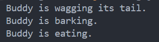
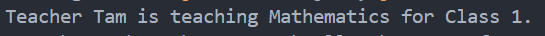

# 👨🏻‍🏫 Lecture 03 - Java Core
> This repository is created as a part of assignment for Lecture 03 - Java Core

## ⚙️ Assignment 01 - Class and Object
### 🐕‍🦺 Task 1 - `Dog` Class
#### Objective
Create a `Dog` class that models a dog's attributes and behaviors.
#### Explanation
**States (Attributes):**
- `color`: The color of the dog.
- `name`: The name of the dog.
- `breed`: The breed of the dog.

**Behaviors (Methods):**
- `wagTail()`: Prints a message indicating the dog is wagging its tail.
- `bark()`: Prints a message indicating the dog is barking.
- `eat()`: Prints a message indicating the dog is eating.

Detail implementation is written on [this code](/Week%2002%20-%20Jun%2017-21//Lecture%2003/Assignment%201/Dog.java), and the output will be something like this.



Here is the explanation on what actually done.
- **Constructor (`Dog(String color, String name, String breed)`)**: Initializes the dog's color, name, and breed.
- **Methods (`wagTail()`, `bark()`, `eat()`)**: Define behaviors to perform specific actions and print corresponding messages.
- **Main Method**: Demonstrates creating a Dog object and invoking its methods.
<br>

### 🎓 Task 2 - `Teacher` and `Subject` Classes
#### Objective
Create `Teacher` and `Subject` classes where a teacher can be assigned a subject to teach.
#### Explanation
1. **[Subject Class](/Week%2002%20-%20Jun%2017-21/Lecture%2003/Assignment%201/Subject.java)**
    **States (Attributes)**
    - `name`: The name of the subject.
    - `classId`: The class identifier for the subject.
    
    **Constructor**
    - Initializes the name and classId.
2. **[Teacher Class](/Week%2002%20-%20Jun%2017-21/Lecture%2003/Assignment%201/Teacher.java)**
    **States (Attributes)**
    - `name`: The name of the teacher.
    - `age`: The age of the teacher.
    - `subject`: The subject the teacher is assigned to (if any).
    
    **Behaviors (Methods)**
    - `assignSubject(Subject subject)`: Assigns a subject to the teacher.
    - `teach()`: Prints a message indicating the teacher is teaching the assigned subject.

Here is the [main program](/Week%2002%20-%20Jun%2017-21//Lecture%2003/Assignment%201/Task2.java) to check the functionality

```java
public class Task2 {
    // Main method for testing
    public static void main(String[] args) {
        Subject math = new Subject("Mathematics", 1);
        Teacher teacher = new Teacher("Tam", 30);
        teacher.assignSubject(math);
        teacher.teach();
    }
}
```

and here's the result



<br>

### 🙋🏻‍♂️ Task 3 - `Student` Class
#### Objective
Create a `Student` class that models a student who can learn multiple subjects.
#### Explanation
**[Student Class](/Week%2002%20-%20Jun%2017-21/Lecture%2003/Assignment%201/Student.java)**
**States (Attributes)**
- `name`: The name of the student.
- `age`: The age of the student.
- `subjects`: A list of subjects the student is learning.

**Behaviors (Methods)**
- `addSubject(Subject subject)`: Adds a subject to the student's list of subjects.
- `learn()`: Prints a message listing all subjects the student is learning.

Here is the [main program](/Week%2002%20-%20Jun%2017-21//Lecture%2003/Assignment%201/Task3.java) to check the functionality

```java
public class Task3 {
    // Main method for testing
    public static void main(String[] args) {
        Subject math = new Subject("Mathematics", 1);
        Subject biology = new Subject("Biology", 2);
        Subject english = new Subject("English", 3);
        Student student = new Student("Alice", 16);
        student.addSubject(math);
        student.addSubject(biology);
        student.addSubject(english);
        student.learn();
    }
}
```

and here's the result

