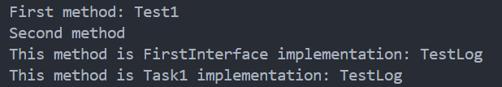

# 👨🏻‍🏫 Lecture 03 - Java Core
> This repository is created as a part of assignment for Lecture 02 - Java Core

## 💡 Assignment 02 - Abstract Class and Interfaces
### ⚔️ Task 1 - Handling Conflicting Default Methods from Multiple Interfaces
When a class implements multiple interfaces that provide default methods with the same signature, it leads to a conflict. To resolve this conflict, the implementing class must provide its own method implementation and explicitly choose which default method to call from the interfaces.

Code Explanation:
In the following example, `Task1` implements both `FirstInterface` and `SecondInterface`, which both provide a `default log` method. `Task1` resolves the conflict by overriding the `log` method and calling the desired interface's default method using `InterfaceName.super.methodName()`.

```java
public class Task1 implements FirstInterface, SecondInterface {
    @Override
    public void firstMethod(String string) {
        System.out.println("First method: " + string);
    }

    @Override
    public void secondMethod() {
        System.out.println("Second method");
    }

    @Override
    public void log(String string) {
        FirstInterface.super.log(string); // Or choose SecondInterface.super.log(string);
        System.out.println("This method is Task1 implementation: " + string); // Alternatively, provide custom implementation
    }

    public static void main(String[] args) {
        Task1 obj = new Task1();
        obj.firstMethod("Test1");
        obj.secondMethod();
        obj.log("TestLog");
    }
}
```

Detail implementation is written on [this code](/Week%2002%20-%20Jun%2017-21//Lecture%2003/Assignment%202/Task1.java), and the output will be something like this.



Here is the explanation on what actually done.
- `Task1` provides its own `log` method, resolving the conflict by choosing which interface's log method to invoke (in this case, the first interface).
- The `super` keyword along with the interface name specifies the exact `default` method to use.

### 🆚 Task 2 - Difference Between Abstract Class and Interface
#### Get to know abstract class and interface
**Abstract Class**
An abstract class in Java is a class that cannot be instantiated directly. It is designed to be subclassed and can contain both abstract methods (without implementation) and concrete methods (with implementation).

**Interface**
An interface in Java is a reference type, similar to a class, that can contain only constants, method signatures, default methods (methods with implementation), static methods, and nested types. Interfaces cannot contain fields that maintain state. Classes implement interfaces to define a contract for behavior.

#### The differences of them
Based on the definition and characteristics, hera are the differences between abstract class and interface.
<table style="width:100%">
    <col width="49%">
    <col width="49%">
    <tr>
        <th>Abstract Class</th>
        <th>Interface</th>
    </tr>
    <tr id="merged-row">
        <td colspan="2"><b>Syntax</b></td>
    </tr>
    <tr>
        <td>Declared with the `abstract` keyword.</td>
        <td>Declared with the `interface` keyword.</td>
    </tr>
    <tr>
        <td>Can have both abstract and concrete methods.</td>
        <td>All methods are implicitly abstract unless they are default or static.</td>
    </tr>
    <tr>
        <td>Can have fields and maintain state. Can have constructors.</td>
        <td>Cannot have instance fields, only constants (fields are public, static, and final by default).</td>
    </tr>
    <tr>
        <td>Subclasses must implement all abstract methods unless the subclass is also abstract using `extends` keyword.</td>
        <td>Implemented by classes using the `implements` keyword.</td>
    </tr>
    <tr id="merged-row">
        <td colspan="2"><b>Purpose</b></td>
    </tr>
    <tr>
        <td><b>Code Reusability</b>: Share common code among closely related classes.</td>
        <td><b>Define a Contract</b>: Specifies what a class should do without dictating how it should do it.</td>
    </tr>
    <tr>
        <td><b>Template for Subclasses</b>: Provide a common base for subclasses with some default behavior or utility methods.</td>
        <td><b>Multiple Inheritance</b>: A class can implement multiple interfaces, allowing for the combination of behaviors from different sources.</td>
    </tr>
    <tr>
        <td><b>Encapsulation</b>: Can hide implementation details and provide a clean API for subclasses.</td>
        <td><b>Decoupling</b>: Allows implementation and functionality to be separate, making code more flexible and easier to refactor.</td>
    </tr>
</table>

#### Key points
| Feature | Abstract Class | Interfaces |
| ---- | ---- | ---- |
| Instantiation | Cannot be instantiated | Cannot be instantiated |
| Methods |	Can have both abstract and concrete methods | Can have abstract, default, and static methods |
| Fields | Can have instance fields and constructors | Cannot have instance fields (only constants) |
| Inheritance | Single inheritance (extends one class) | Multiple inheritance (implements multiple interfaces) |
| Usage | Used for classes with shared code	| Used to define a contract for unrelated classes |
| Access Modifiers | Methods can have any access modifier | Methods are public by default (abstract methods) |
| Constructor | Can have constructors	| Cannot have constructors |
| When to Use | When you have a base class with common code to share | When you want to define a contract for various classes to implement |

#### Examples
**Abstract Class**
```java
public abstract class Animal {
    private String name;

    // Abstract method (no implementation)
    public abstract void makeSound();

    // Concrete method
    public void sleep() {
        System.out.println("Sleeping...");
    }

    // Getter and setter for the name
    public String getName() {
        return name;
    }

    public void setName(String name) {
        this.name = name;
    }
}
```
Here is the explanation on what actually done.
- `Animal` is an abstract class.
- `makeSound` is an abstract method that subclasses must implement.
- `sleep` is a concrete method with implementation.
- Includes fields and methods to manage the state (`name`).

**Interface**
```java
public interface AnimalBehavior {
    // Abstract method
    void makeSound();

    // Default method
    default void sleep() {
        System.out.println("Default: Sleeping...");
    }

    // Static method
    static void eat() {
        System.out.println("Eating...");
    }
}
```
Here is the explanation on what actually done.
- `AnimalBehavior` is an interface.
- `makeSound` is an abstract method that implementing classes must define.
- `sleep` is a default method with implementation.
- `eat` is a static method accessible directly through the interface.

### 🤔 Task 3 - Research on `@FunctionalInterface`
A `@FunctionalInterface` annotation is used to denote an interface that is intended to be a functional interface. A functional interface has exactly one abstract method, making it a suitable target for lambda expressions or method references in Java.

For example.
```java
@FunctionalInterface
interface MyFunctionalInterface {
    void execute();
}
```
This ensures the interface cannot have more than one abstract method, which helps in making code cleaner and easier to use with lambda expressions.

```java
@FunctionalInterface
interface MyFunctionalInterface {
    void execute();

    // Uncommenting below method will cause a compile-time error
    // void anotherMethod();
}
```

### ✍ Task 4 - Implement `SavingAccount` and `CurrentAccount`
Here i implement class `SavingAccount` and `CurrentAccount`, both implementing the `Account` interface. Each account type has its unique behaviors, and they log messages with their `accountId`.
1. **[Account Interface](/Week%2002%20-%20Jun%2017-21/Lecture%2003/Assignment%202/Account.java)**
Defines the contract for both account types, including deposit, withdraw, and log methods.
    - Defines methods that any account must implement.
    - Includes a default `log` method that adds `accountId` to log messages
    - `isValidAccountId` shows how static methods can be included in interfaces to validate account ID is formatted perfectly.
2. **[SavingAccount](/Week%2002%20-%20Jun%2017-21/Lecture%2003/Assignment%202/SavingAccount.java)**
Represents a savings account with methods for deposit, withdrawal, and logging.
    - Implements `Account` methods.
    - Uses `accountId` for identification in logs.
3. **[CurrentAccount](/Week%2002%20-%20Jun%2017-21/Lecture%2003/Assignment%202/CurrentAccount.java)**
Represents a current account with overdraft capabilities.
    - Adds an overdraft limit feature.
    - Implements `Account` methods with `accountId` for logging.
3. **[Main Class](/Week%2002%20-%20Jun%2017-21/Lecture%2003/Assignment%202/Task4.java)**
Demonstrates different account types with different `accountId`s.
    - Demonstrates the behavior of different accounts (`SavingAccount` and `CurrentAccount`) with unique `accountIds`.
    - Logs transactions with `accountId`.
    - Shows how the default log method and static method from `Account` are used to validate ID.

And the output of the program shows like this.

