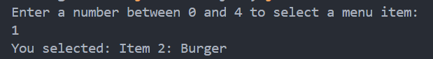
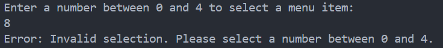
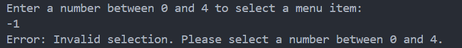
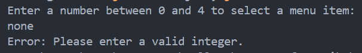
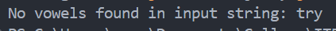

# 👨🏻‍🏫 Lecture 03 - Java Core
> This repository is created as a part of assignment for Lecture 03 - Java Core

## 🚫 Assignment 03 - Exceptions
### 🗃️ Task 1 - Research and Explain `try-with-resources`
`try-with-resources` is a feature in Java that simplifies the process of working with resources such as files, network connections, or streams that need to be closed after they are used. It was introduced in Java 7 and helps to avoid resource leaks by ensuring that each resource is closed at the end of the statement.

#### 🔑 Key Points
1. **Automatic Resource Management**
    Resources opened within the `try` block are automatically closed after the `try` block finishes, even if an exception occurs.
2. **Implementing `AutoCloseable`**
    Any resource used in `try-with-resources` must implement the `AutoCloseable` interface, which provides a `close()` method.
3. **Multiple Resources**
    We can declare multiple resources in a single `try` statement, separated by semicolons.

Here is the basic syntax.
```java
try (ResourceType resource = new ResourceType()) {
    // Use the resource
} catch (ExceptionType e) {
    // Handle exception
}
```

Here, `ResourceType` should implement `AutoCloseable`, and the resource is closed automatically.

Consider a scenario where we read from a file and print its contents.
```java
import java.io.*;

public class TryWithResourcesExample {
    public static void main(String[] args) {
        // Using try-with-resources to manage BufferedReader
        try (BufferedReader br = new BufferedReader(new FileReader("example.txt"))) {
            String line;
            while ((line = br.readLine()) != null) {
                System.out.println(line);
            }
        } catch (IOException e) {
            e.printStackTrace();
        }
    }
}
```

#### 👣 Steps and Benefits
1. **Resource Declaration**: `BufferedReader br = new BufferedReader(new FileReader("example.txt"))` declares and initializes the resource.
2. **Automatic Closure**: When the `try` block ends, whether normally or abruptly (due to an exception), `BufferedReader` is automatically closed.
3. **Exception Handling**: The `catch` block handles any `IOException` that may occur during file operations.

#### ➕ Multiple Resources
Multiple resources is also possible to in a single `try-with-resources` statement. Each resource is separated by a semicolon (`;`).

```java
import java.io.*;

public class MultipleResourcesExample {
    public static void main(String[] args) {
        // Using try-with-resources to manage both BufferedReader and BufferedWriter
        try (BufferedReader br = new BufferedReader(new FileReader("input.txt"));
             BufferedWriter bw = new BufferedWriter(new FileWriter("output.txt"))) {

            String line;
            while ((line = br.readLine()) != null) {
                bw.write(line);
                bw.newLine();
            }
        } catch (IOException e) {
            e.printStackTrace();
        }
    }
}
```
<br>

### 🗑️ Task 2 - `throw` vs `throws`
#### Get to know `throw` and `throws`
`throw` and `throws` are both related to exception handling in Java, but they serve different purposes.

##### **`throw`**
**Purpose**: Used to explicitly throw an exception from a method or block of code.
**Types of Exceptions**: Can be used to throw both checked and unchecked exceptions.
**Syntax**: `throw new ExceptionType("Error Message");`
**Location**: Can be used inside any method or block of code to indicate that something has gone wrong.

#### The example of `throw`
```java
public class ThrowExample {
    public static void main(String[] args) {
        try {
            validateAge(15); // This will throw an exception
        } catch (IllegalArgumentException e) {
            System.out.println(e.getMessage());
        }
    }

    public static void validateAge(int age) {
        if (age < 18) {
            throw new IllegalArgumentException("Age must be 18 or older.");
        } else {
            System.out.println("Age is valid.");
        }
    }
}
```
Here is the explanation on what actually done.
- The `validateAge` method throws an `IllegalArgumentException` if the age is less than 18.
- The `main` method catches this exception and prints the error message.

##### **`throws`**
**Purpose**: Used in a method signature to declare that the method might throw one or more exceptions.
**Types of Exceptions**: Typically used to declare checked exceptions that a method might throw.
**Syntax**: `void methodName() throws ExceptionType1, ExceptionType2 { ... }`
**Location**: Appears in the method declaration and indicates that the caller of the method must handle or propagate these exceptions.

#### The example of `throws`
```java
import java.io.BufferedReader;
import java.io.FileReader;
import java.io.IOException;

public class ThrowsExample {
    public static void main(String[] args) {
        try {
            readFile("nonexistentfile.txt");
        } catch (IOException e) {
            System.out.println("Caught exception: " + e.getMessage());
        }
    }

    public static void readFile(String fileName) throws IOException {
        BufferedReader br = new BufferedReader(new FileReader(fileName));
        String line;
        while ((line = br.readLine()) != null) {
            System.out.println(line);
        }
        br.close();
    }
}
```
Here is the explanation on what actually done.
- The `readFile` method declares that it throws an `IOException`.
- The `main` method must handle this `IOException` either with a `try-catch` block or by propagating it further up the call stack.

#### 🤷🏻‍♂️ The Differences
Here are the differences of them
| Feature | throw |	throws |
| -- | -- | -- |
| Purpose | Explicitly throw an exception. |	Declare that a method can throw exceptions. |
| Usage | Used within method body or code block. |	Used in method signature. |
| Types of Exceptions |	Both checked and unchecked exceptions.	| Primarily for checked exceptions. |
| Handling |	Exception must be caught or propagated immediately.	| Caller of the method must handle or declare it further. |

#### 🤔 Use Cases
**`throw`**
- When we need to explicitly throw an exception based on certain conditions in our code.
- Example: Validating user input and throwing an exception if the input is invalid.

**`throws`**
- When defining a method that performs operations which might cause exceptions that the method itself does not handle.
- Example: File operations, database interactions, or network communications where exceptions are likely and must be handled by the method’s caller.
<br>

### 📝 Lab 1 - File Operations with `try-with-resources`
#### 📌 Steps:
1. Create a file `test1.txt` with the content “Hello, some text here.”
2. Write an application that reads the file and prints its content to the console.
3. Write the content to another file `test2.txt.`

Detail implementation is written on [this code](/Week%2002%20-%20Jun%2017-21//Lecture%2003/Assignment%203//Lab1.java) with this [test1.txt](/Week%2002%20-%20Jun%2017-21/Lecture%2003/Assignment%203/test1.txt).

Here is the output if `test1.txt` exist


The content also copied to `test2.txt`, and here is the output if the `test1`.txt` is not exist.


<br>

### 📝 Lab 2 - Array Menu with Exception Handling
#### 📌 Steps:
1. Create an array menu with 5 elements.
2. Prompt the user to enter a number and print the corresponding menu item.
3. Handle exceptions if the user enters an index out of bounds.

Detail implementation is written on [this code](/Week%2002%20-%20Jun%2017-21//Lecture%2003/Assignment%203//Lab2.java).

Here is the output of all input possibilities
1. Normal input

    

2. Negative number

    

3. Bigger than 4

    

4. Input none
    
    

5. Input string instead of integer
    
    

<br>

### 📝 Lab 3 - Method to Check for Vowels with Custom Exception
#### 📌 Steps:
1. Create a method that checks if a string contains vowels.
2. Throw a custom exception if no vowels are found.

Detail implementation is written on [this code](/Week%2002%20-%20Jun%2017-21//Lecture%2003/Assignment%203//Lab3.java).

By using this test part code.
```java
public static void main(String[] args) {
    try {
        checkForVowels("try");
        checkForVowels("sky");
    } catch (NoVowelsException e) {
        System.out.println(e.getMessage());
    }
}
```

The output shows like this.

