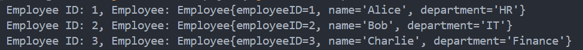

# 👩🏻‍🏫 Lecture 03 - Java Core
> This repository is created as a part of assignment for Lecture 03 - Java Core

## 📚 Assignment 05 - Java Collections
### 🔍 Task 1 - Collection Comparison
#### 🆚 ArrayList vs. LinkedList
| Aspects | `ArrayList` | `LinkedList` |
| ---- | ---- | ---- |
| Order | Maintains the insertion order. | Maintains the insertion order. |
| Null elements | Allows null elements. | Allows null elements. |
| Performance (Access) | `O(1)` – ArrayList has a backing array, providing constant time access to any element by index.| `O(n)` – Traverses the list from the start or end, making access time linear. |
| Performance (Insert) | `O(1)` amortized – Appends to the end are usually constant time, but inserting in the middle requires shifting elements, making it `O(n)` in the worst case. | `O(1)` – Insertion at the beginning or end is constant time. |
| Performance (Remove) | `O(n)` – Removing an element requires shifting elements to fill the gap. | `O(1)` – Removal of the first or last element is constant time; otherwise, it’s `O(n)`. |
| Performance (Memory) | Automatic resizing involves copying elements to a new array, which is `O(n)` when it happens. | Requires more memory per element than `ArrayList` due to storage for node pointers. |
| Synchronized | Not synchronized by default. Use `Collections.synchronizedList` for thread safety. | Not synchronized by default. Use `Collections.synchronizedList` for thread safety. |
| Fail-Fast Iterators | Iterators throw `ConcurrentModificationException` if the list is modified during iteration. | Iterators throw `ConcurrentModificationException` if the list is modified during iteration. |

#### ❓ When to Use?
- `ArrayList`: Prefer when we need fast access by index and infrequent insertions/removals.
- `LinkedList`: Prefer when we have frequent insertions/removals and do not require fast access by index.

#### 🆚 HashSet vs. TreeSet vs. LinkedHashSet
| Aspects | `HashSet` | `TreeSet` | `LinkedHashSet` |
| ---- | ---- | ---- | --- |
| Order | No guaranteed order. | Maintains a sorted order based on natural ordering or a comparator. | Maintains insertion order. |
| Null elements | Allows a single null element. | Does not allow null elements. | Allows a single null element. |
| Performance (Insert) | `O(1)` – Constant time for most operations. | `O(log n)` – Elements are added while maintaining  order. | `O(1)` – Constant time while maintaining insertion order. |
| Performance (Search) | `O(1)` – Efficient hashing gives constant time on average. | `O(log n)` – Efficient searching as it is based on binary search trees. | `O(1)` – Efficient hashing gives constant time on average. |
| Performance (Remove) | `O(1)` – Constant time on average. | `O(log n)` – Removal is also logarithmic due to rebalancing. | `O(1)` – Constant time on average. |
| Synchronized | Not synchronized. Use `Collections.synchronizedSet` for thread safety. | Not synchronized. Use `Collections.synchronizedSortedSet` for thread safety. | Not synchronized. Use `Collections.synchronizedSet` for thread safety. |

#### ❓ When to Use?
- `HashSet`: Prefer for the best performance when order doesn’t matter.
- `TreeSet`: Use when we need a sorted set.
- `LinkedHashSet`: Use when we need a set that maintains insertion order.
<br>

### 🧩 Task 2 - Retrieve an Element from an ArrayList
In Java, we can retrieve an element from an `ArrayList` by using the `get()` method. The `ArrayList` class is part of the `java.util package` and allows for dynamic arrays that can grow as needed.

Here’s how we can retrieve an element at a specified index:
1. Creating an `ArrayList`: First, we create an `ArrayList` and populate it with elements.
2. Accessing Elements: We use the `get()` method provided by the `ArrayList` class to retrieve the element at the desired index.
3. Handling Index Validity: It's important to check if the index is within the valid range (from `0` to `size()-1`) to avoid `IndexOutOfBoundsException`.

```java
import java.util.ArrayList;

public class RetrieveElement {
    public static void main(String[] args) {
        // Create an ArrayList and add some elements
        ArrayList<String> list = new ArrayList<>();
        list.add("Apple");
        list.add("Banana");
        list.add("Cherry");
        list.add("Date");

        // Specify the index to retrieve
        int index = 2;

        // Retrieve the element at the specified index
        if (index >= 0 && index < list.size()) {
            String element = list.get(index);
            System.out.println("Element at index " + index + ": " + element);
            // Output: Element at index 2: Cherry
        } else {
            System.out.println("Index out of bounds.");
        }
    }
}
```
<br>

### 🧹 Task 3 - Removing Duplicate Lines by Key Field from a File
#### 📝 Procedure
To remove duplicate lines from a file:
1. **Reading the File**: Read the content of the file line by line.
2. **Identifying Key Field**: Determine which field in each line will serve as the key for identifying duplicates.
3. **Using a Set for Uniqueness**: Use a `HashSet` to track keys of lines that have already been encountered.
4. **Writing Unique Lines**: Write only those lines to a new file that haven't been seen before (not in the `HashSet`).

#### 📋 Case CSV Content
In this program, i use CSV file [`input.csv`](/Week%2002%20-%20Jun%2017-21/Lecture%2003/Assignment%205/data/input.csv) with content like this.
```csv
employeeID,name,department
1,Alice,HR
2,Bob,IT
3,Bono,QA
3,Charlie,Finance
4,Daniel,IT
5,Eve,HR
5,Edward,Marketing
2,Leo,HR
```
In this case, we want to remove duplicate lines based on the `employeeID` field.

#### 💻 Final Program
Detail implementation is written on [this code](/Week%2002%20-%20Jun%2017-21/Lecture%2003/Assignment%205/RemoveDuplicates.java). Here’s what the program actually done.
1. **File Handling**: `BufferedReader` is used to read from `input.csv`, and `PrintWriter` is used to write to `output.csv`.
2. **HashSet (`seenKeys`)**: This set keeps track of keys (`employeeID`) that have already been encountered. This allows us to efficiently check for duplicates.
3. **Processing Each Line**:
    - Each line is split into fields using `line.split(delimiter)`.
    - The first field (`fields[0]`) is considered the key (`employeeID`).
    - If the key is not in `seenKeys`, it means the line hasn't been encountered before, so it's written to `output.csv` and added to `seenKeys`.
4. **Output**: After processing all lines, the program prints a success message indicating that duplicates have been removed and the output file (`output.csv`) has been created.

The output of the program shows on this [`output.csv`](/Week%2002%20-%20Jun%2017-21/Lecture%2003/Assignment%205/data/output.csv)

<br>

### 🖨️ Task 4 - Get a Shallow Copy of a `HashMap`
A shallow copy of a `HashMap` means creating a new `HashMap` instance that has the same key-value pairs as the original. Changes to the new map won’t affect the original map, but changes to the objects (if they are mutable) that the map’s keys or values refer to will affect both maps.

For example, Imagine we have a `HashMap` that maps employee IDs to employee objects. We want to create a copy of this `HashMap` for some operation without affecting the original map.

```java
import java.util.HashMap;

public class ShallowCopyHashMap {
    public static void main(String[] args) {
        // Original HashMap
        HashMap<Integer, String> originalMap = new HashMap<>();
        originalMap.put(1, "Alice");
        originalMap.put(2, "Bob");
        originalMap.put(3, "Charlie");

        // Creating a shallow copy using the copy constructor
        HashMap<Integer, String> copyMap = new HashMap<>(originalMap);

        // Adding an element to the original map
        originalMap.put(4, "David");

        // Displaying both maps
        System.out.println("Original HashMap: " + originalMap);
        // Output: Original HashMap: {1=Alice, 2=Bob, 3=Charlie, 4=David}
        System.out.println("Shallow Copy HashMap: " + copyMap);
        // Output: Shallow Copy HashMap: {1=Alice, 2=Bob, 3=Charlie}
    }
}
```
Here’s what the program actually done.
1. **HashMap Initialization**: `HashMap<Integer, String> originalMap = new HashMap<>();` creates a `HashMap` that maps `Integer` keys (employee IDs) to `String` values (employee names).
2. **Populating the HashMap**: `originalMap.put(...);` adds key-value pairs to the `originalMap`.
3. **Creating a Shallow Copy**: `HashMap<Integer, String> copyMap = new HashMap<>(originalMap);`
The copy constructor `new HashMap<>(originalMap)` creates a new `HashMap` (`copyMap`) containing the same mappings as `originalMap`.
4. **Modifying the Original Map**: `originalMap.put(4, "David");` adds a new entry to `originalMap` after creating the copy.
5. **Output**: The program prints both `originalMap` and `copyMap`. Since it's a shallow copy, modifying `originalMap` (`put(4, "David")`) affects only `originalMap`, not `copyMap`.

Besides using the copy constructor, we can also use the `putAll()` method to copy the contents of one `HashMap` into anothe.
```java
// Alternative method using putAll() for shallow copy
HashMap<Integer, String> copyMap = new HashMap<>();
copyMap.putAll(originalMap);
```
Both approaches achieve the same result, which is a shallow copy of the `HashMap`.

<br>

### 🔀 Task 5 - Converting List to Map in Java
Imagine we have a `List` of `Employee` objects, and each `Employee` has a unique `employeeID`. We want to convert this `List` into a `Map` where each `employeeID` acts as the key, and the corresponding `Employee` object is the value in the map.

#### ✍ Implementation Steps
Here i implement class `BankAccount` and `BankAccountDemo`.
1. **Create a `List` of Objects**: Populate a `List` with objects (Employee objects in this case).
2. **Define a Key Mapper Function**: Decide how we want to map each object to its key. In our case, it's the `employeeID` of each `Employee`.
3. **Use Java Streams for Transformation**: Utilize Java Streams API to transform the `List` into a `Map`.
4. **Collect into Map**: Use the `Collectors.toMap()` method to collect elements of the `List` into a `Map` using the specified key and value mappings.

Detail implementation is written on [this code](/Week%2002%20-%20Jun%2017-21/Lecture%2003/Assignment%205/ListToMap.java), and the output of the program shows like this.



<br>

### ⚡ Task 6 - Demo `CopyOnWriteArrayList`
`CopyOnWriteArrayList` is a thread-safe variant of `ArrayList` in which all mutative operations (`add`, `set`, etc.) are implemented by making a fresh copy of the underlying array. It is useful in scenarios where reads are more frequent than writes.

Here is the code example.
```java
import java.util.concurrent.CopyOnWriteArrayList;

public class COWArrayListDemo {
    public static void main(String[] args) {
        // Create a CopyOnWriteArrayList
        CopyOnWriteArrayList<Integer> numbers = new CopyOnWriteArrayList<>();
        
        // Add elements to the list
        numbers.add(1);
        numbers.add(2);
        numbers.add(3);
        
        // Print initial list
        System.out.println("Initial List: " + numbers);
        
        // Iterate over the list and modify it
        for (Integer number : numbers) {
            System.out.println("Current Element: " + number);
            numbers.add(number + 10); // Modify the list by adding 10 to each element
        }
        
        // Print modified list
        System.out.println("Modified List: " + numbers);
    }
}
```

Detail implementation is written on [this code](/Week%2002%20-%20Jun%2017-21/Lecture%2003/Assignment%205/COWArrayListDemo.java), and the output of the program shows like this.


<br>

### 🔗 Task 7 - Demo `ConcurrentHashMap`
`ConcurrentHashMap` is a thread-safe version of `HashMap` that allows concurrent access to different segments of the map. This allows for high throughput in concurrent environments.

Here is the code example.
```java
import java.util.concurrent.ConcurrentHashMap;

public class ConcurrentHashMapDemo {
    public static void main(String[] args) {
        ConcurrentHashMap<Integer, String> map = new ConcurrentHashMap<>();
        map.put(1, "Apple");
        map.put(2, "Banana");
        map.put(3, "Cherry");

        // Accessing map concurrently
        Runnable task1 = () -> {
            for (int i = 4; i <= 6; i++) {
                map.put(i, "Fruit" + i);
                System.out.println("Added Fruit" + i);
            }
        };

        Runnable task2 = () -> {
            for (int i = 1; i <= 3; i++) {
                System.out.println("Value for key " + i + ": " + map.get(i));
            }
        };

        Thread thread1 = new Thread(task1);
        Thread thread2 = new Thread(task2);

        thread1.start();
        thread2.start();
    }
}
```

Detail implementation is written on [this code](/Week%2002%20-%20Jun%2017-21/Lecture%2003/Assignment%205/ConcurrentHashMapDemo.java), and the output of the program shows like this.

