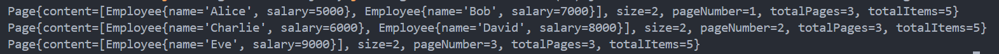

# 👩🏻‍🏫 Lecture 04 - Java Core
> This repository is created as a part of assignment for Lecture 04 - Java Core

## 🤨 Assignment 07 - Generics
### ❌ Task 1 - Remove Duplicated Items
#### 📖 Task and Objectives
- Remove duplicated items from any list of objects.
- Eliminate duplicated fields within custom objects.

#### 1️⃣ Removing Duplicated Items from a List
##### Using `Set` for Simple Types
The `Set` collection in Java automatically eliminates duplicates. We can convert a list to a set and back to a list to remove duplicates.

```java
import java.util.*;

public class RemoveDuplicates {
    public static void main(String[] args) {
        List<String> list = Arrays.asList("apple", "banana", "apple", "orange");
        Set<String> set = new HashSet<>(list);  // Removing duplicates
        List<String> uniqueList = new ArrayList<>(set);
        System.out.println(uniqueList); // Output: [banana, orange, apple]
    }
}
```
This approach works well for simple types like `String` or `Integer`.

##### Using Stream API for Any Object
For custom objects, we can use the Stream API to filter duplicates based on specific criteria.

For example, given a `Person` class
```java
import java.util.*;
import java.util.stream.*;

class Person {
    String name;
    int age;

    public Person(String name, int age) {
        this.name = name;
        this.age = age;
    }

    public String getName() {
        return this.name;
    }

    public int getAge() {
        return this.age;
    }

    @Override
    public String toString() {
        return "Person{name='" + name + "', age=" + age + '}';
    }
}
```

then the removing the duplicate using streams would be like this.
```java
public class RemoveDuplicates {
    public static void main(String[] args) {
        List<Person> list = Arrays.asList(
            new Person("Alice", 30),
            new Person("Bob", 25),
            new Person("Alice", 30)
        );

        List<Person> uniqueList = list.stream()
            .distinct()  // Removing duplicates
            .collect(Collectors.toList());

        System.out.println(uniqueList); // Output: [Person{name='Alice', age=30}, Person{name='Bob', age=25}]
    }
}
```

#### 2️⃣ Removing Duplicated Fields in Objects
When dealing with objects containing duplicated fields, we need to:
- Define what constitutes a duplicate field.
- Use a suitable data structure or process to filter out duplicates.

For example, imagine we have a list of Person objects and we want to ensure that no two Person objects have the same name. We can achieve this by using a `Map` to store only unique names.

```java
import java.util.*;
import java.util.stream.Collectors;

public class RemoveDuplicates {
    public static void main(String[] args) {
        List<Person> list = Arrays.asList(
            new Person("Alice", 30),
            new Person("Bob", 25),
            new Person("Alice", 35)
        );

        Map<String, Person> uniqueByName = list.stream()
            .collect(Collectors.toMap(
                p -> p.name,
                p -> p,
                (existing, replacement) -> existing)); // Use existing person for duplicate names

        List<Person> uniqueList = new ArrayList<>(uniqueByName.values());
        System.out.println(uniqueList); // Output: [Person{name='Alice', age=30}, Person{name='Bob', age=25}]
    }
}
```

In the `collect` method, we use a `Map` where the key is the `name`, and the value is the `Person` object. The `(existing, replacement) -> existing` lambda ensures that if there is a duplicate name, the first encountered `Person` is kept.

##### Using `TreeSet` with a `Comparator`
A `TreeSet` with a custom `Comparator` can also be used to ensure unique fields.

```java
import java.util.*;

public class RemoveDuplicates {
    public static void main(String[] args) {
        List<Person> list = Arrays.asList(
            new Person("Alice", 30),
            new Person("Bob", 25),
            new Person("Alice", 35)
        );

        Set<Person> uniqueByName = new TreeSet<>(Comparator.comparing(p -> p.name));
        uniqueByName.addAll(list);

        List<Person> uniqueList = new ArrayList<>(uniqueByName);
        System.out.println(uniqueList); // Output: [Person{name='Alice', age=30}, Person{name='Bob', age=25}]
    }
}
```

Here, a `TreeSet` uses a custom `Comparator` that compares `Person` objects based on their `name`, ensuring uniqueness.

#### 3️⃣ Using Generics
To remove duplicate items, we can use a `Set` to filter out duplicates and return a list without duplicates.

```java
import java.util.*;
import java.util.stream.Collectors;

class ListUtils {
    public static <T> List<T> removeDuplicates(List<T> list) {
        return list.stream()
                .distinct() // Filter out duplicates
                .collect(Collectors.toList());
    }
}

public class RemoveDuplicates {
    public static void main(String[] args) {
        List<String> names = Arrays.asList("Alice", "Bob", "Charlie", "Alice", "Bob");
        List<String> uniqueNames = ListUtils.removeDuplicates(names);
        System.out.println(uniqueNames); // Output: [Alice, Bob, Charlie]
    }
}
```
To remove duplicates based on specific fields, we need to define what makes two objects equivalent. For this, we can use a custom comparator or provide a key extractor.
```java
import java.util.*;
import java.util.function.Function;
import java.util.stream.Collectors;

class ListUtils {
    public static <T, K> List<T> removeDuplicatesByField(List<T> list, Function<? super T, ? extends K> keyExtractor) {
        Set<K> seenKeys = new HashSet<>();
        return list.stream()
                .filter(e -> seenKeys.add(keyExtractor.apply(e))) // used to track the keys that have already been encountered.
                .collect(Collectors.toList());
    }
}

public class RemoveDuplicates {
    public static void main(String[] args) {
        List<Person> list = Arrays.asList(
            new Person("Alice", 30),
            new Person("Bob", 25),
            new Person("Alice", 35)
        );

        List<Person> uniquePerson = ListUtils.removeDuplicatesByField(
            list,
            Person::getName
        );

        System.out.println(uniquePerson);
        // Output: [Person{name='Alice', age=30}, Person{name='Bob', age=25}]
    }
}
```

<br>

### ❓ Task 2 - Using Wildcards With Generics
#### 🤔 Types of Wildcards
- **Unbounded Wildcards `(?)`**: Accepts any type.
- **Bounded Wildcards `(? extends T)`**: Accepts a type that is a subtype of `T`.
- **Lower Bounded Wildcards `(? super T)`**: Accepts a type that is a supertype of `T`.

#### ❌ Unbounded Wildcards
Use `?` when the method can operate on any type.

```java
import java.util.*;

public class WildcardDemo {
    public static void printList(List<?> list) {
        for (Object elem : list) {
            System.out.print(elem + " ");
        }
        System.out.println();
    }

    public static void main(String[] args) {
        List<Integer> intList = Arrays.asList(1, 2, 3);
        List<String> strList = Arrays.asList("a", "b", "c");

        printList(intList); // Output: 1 2 3 
        printList(strList); // Output: a b c 
    }
}
```

Here, `List<?>` can be a list of any type (`Integer`, `String`, etc.).

#### ⏫ Upper Bounded Wildcards (`? extends T`)
Use `? extends T` when the method is constrained to operate on a subtype of `T`.

```java
import java.util.*;

public class WildcardDemo {
    public static double sumOfList(List<? extends Number> list) {
        double sum = 0.0;
        for (Number num : list) {
            sum += num.doubleValue();
        }
        return sum;
    }

    public static void main(String[] args) {
        List<Integer> intList = Arrays.asList(1, 2, 3);
        List<Double> doubleList = Arrays.asList(1.1, 2.2, 3.3);

        System.out.println(sumOfList(intList));    // Output: 6.0
        System.out.println(sumOfList(doubleList)); // Output: 6.6
    }
}
```

Here, `List<? extends Number>` accepts a list of `Number` or any subclass like `Integer`, `Double`, etc.

#### ⏬ Lower Bounded Wildcards (`? super T`)
Use `? super T` when the method needs to accept a type that is a supertype of `T`.

```java
import java.util.*;

public class WildcardDemo {
    public static void addNumbers(List<? super Integer> list) {
        list.add(1);
        list.add(2);
        list.add(3);
    }

    public static void main(String[] args) {
        List<Number> numList = new ArrayList<>();
        List<Object> objList = new ArrayList<>();

        addNumbers(numList);
        addNumbers(objList);

        System.out.println(numList); // Output: [1, 2, 3]
        System.out.println(objList); // Output: [1, 2, 3]
    }
}
```

Here, `List<? super Integer>` accepts a list of `Integer`, `Number`, `Object`, or any supertype of `Integer`.

#### 👀 Generic Classes and Wildcards
We can also use wildcards with generic classes to allow flexibility in type parameters.

```java
class Box<T> {
    private T item;

    public Box(T item) {
        this.item = item;
    }

    public T getItem() {
        return item;
    }
}

public class WildcardDemo {
    public static void printBox(Box<?> box) {
        System.out.println("Box contains: " + box.getItem());
    }

    public static void main(String[] args) {
        Box<Integer> intBox = new Box<>(123);
        Box<String> strBox = new Box<>("Hello");

        printBox(intBox); // Output: Box contains: 123
        printBox(strBox); // Output: Box contains: Hello
    }
}
```

<br>

### 🧮 Task 3 - Operations on a List of Objects
#### 📖 Task and Objectives
- Sort a list by any field.
- Find the item with the maximum value of any field.

#### 1️⃣ Sorting a List by Any Field
##### Sorting by a Field Using `Comparator`
We can sort a list by a specific field using `Comparator`.

For example, given a `Employee` class
```java
class Employee {
    String name;
    int salary;

    public Employee(String name, int salary) {
        this.name = name;
        this.salary = salary;
    }

    public String getName() {
        return name;
    }

    public int getSalary() {
        return salary;
    }

    @Override
    public String toString() {
        return "Employee{name='" + name + "', salary=" + salary + '}';
    }
}
```

then the sorting a list would be like this.
```java
public class EmployeeOperation {
    public static void main(String[] args) {
        List<Employee> list = Arrays.asList(
            new Employee("Alice", 5000),
            new Employee("Bob", 7000),
            new Employee("Charlie", 6000)
        );

        // Sort by salary
        list.sort(Comparator.comparingInt(e -> e.salary));
        System.out.println("Sorted by salary: " + list);
        // Output: Sorted by salary: [Employee{name='Alice', salary=5000}, Employee{name='Charlie', salary=6000}, Employee{name='Bob', salary=7000}]

        // Sort by name
        list.sort(Comparator.comparing(e -> e.name));
        System.out.println("Sorted by name: " + list);
        // Output: Sorted by name: [Employee{name='Alice', salary=5000}, Employee{name='Bob', salary=7000}, Employee{name='Charlie', salary=6000}]
    }
}
```

##### Sorting by Multiple Fields
We can also sort by multiple fields using `Comparator` chaining.

```java
public class EmployeeOperation {
    public static void main(String[] args) {
        List<Employee> list = Arrays.asList(
            new Employee("Alice", 5000),
            new Employee("Bob", 7000),
            new Employee("Charlie", 6000),
            new Employee("Bob", 5000)
        );

        // Sort by salary, then by name
        list.sort(Comparator.comparingInt((Employee e) -> e.salary).thenComparing(e -> e.name));
        System.out.println("Sorted by salary and then by name: " + list);
        // Output: Sorted by salary and then by name: [Employee{name='Alice', salary=5000}, Employee{name='Bob', salary=5000}, Employee{name='Charlie', salary=6000}, Employee{name='Bob', salary=7000}]
    }
}
```

##### Sorting Using `Stream` API
We can also sort a list using the `Stream` API.

```java
import java.util.*;
import java.util.stream.*;

public class EmployeeOperation {
    public static void main(String[] args) {
        List<Employee> list = Arrays.asList(
            new Employee("Alice", 5000),
            new Employee("Bob", 7000),
            new Employee("Charlie", 6000)
        );

        List<Employee> sortedList = list.stream()
            .sorted(Comparator.comparingInt(Employee::getSalary))
            .collect(Collectors.toList());

        System.out.println("Sorted by salary using Stream: " + sortedList);
        // Output: Sorted by salary using Stream: [Employee{name='Alice', salary=5000}, Employee{name='Charlie', salary=6000}, Employee{name='Bob', salary=7000}]
    }
}
```

#### 2️⃣ Finding the Item with the Maximum Value of Any Field
##### Finding Max Using `Collections.max`
Example: Finding the employee with the maximum salary.
```java
import java.util.*;

public class EmployeeOperation {
    public static void main(String[] args) {
        List<Employee> list = Arrays.asList(
            new Employee("Alice", 5000),
            new Employee("Bob", 7000),
            new Employee("Charlie", 6000)
        );

        Employee maxSalaryEmployee = Collections.max(list, Comparator.comparingInt(Employee::getSalary));
        System.out.println("Employee with max salary: " + maxSalaryEmployee);
        // Output: Employee with max salary: Employee{name='Bob', salary=7000}
    }
}
```

##### Finding Max Using `Stream` API
Example: Finding the employee with the maximum salary using `Stream`.
```java
import java.util.*;
import java.util.stream.*;

public class EmployeeOperation {
    public static void main(String[] args) {
        List<Employee> list = Arrays.asList(
            new Employee("Alice", 5000),
            new Employee("Bob", 7000),
            new Employee("Charlie", 6000)
        );

        Optional<Employee> maxSalaryEmployee = list.stream()
            .max(Comparator.comparingInt(Employee::getSalary));

        maxSalaryEmployee.ifPresent(e -> System.out.println("Employee with max salary: " + e));
        // Output: Employee with max salary: Employee{name='Bob', salary=7000}
    }
}
```

#### 3️⃣ Combining Both
```java
public class EmployeeOperation {
    public static void main(String[] args) {
        List<Employee> list = Arrays.asList(
            new Employee("Alice", 5000),
            new Employee("Bob", 7000),
            new Employee("Charlie", 6000)
        );

        // Sorting by salary
        list.sort(Comparator.comparingInt(Employee::getSalary));
        System.out.println("Sorted by salary: " + list);

        // Finding max salary
        Employee maxSalaryEmployee = list.stream()
            .max(Comparator.comparingInt(Employee::getSalary))
            .orElseThrow(() -> new NoSuchElementException("No employee found"));

        System.out.println("Employee with max salary: " + maxSalaryEmployee);
    }
}
```

#### 4️⃣ Using Generics
We’ll create generic methods to sort a list and find the item with the maximum value based on any specified field.

```java
import java.util.*;
import java.util.function.Function;
import java.util.stream.Collectors;

class ListUtils {
    public static <T, U extends Comparable<? super U>> List<T> sortByField(List<T> list, Function<? super T, ? extends U> keyExtractor) {
        return list.stream()
                .sorted(Comparator.comparing(keyExtractor))
                .collect(Collectors.toList());
    }

    public static <T, U extends Comparable<? super U>> Optional<T> findMaxByField(List<T> list, Function<? super T, ? extends U> keyExtractor) {
        return list.stream()
                .max(Comparator.comparing(keyExtractor));
    }
}

public class EmployeeOperation {
    public static void main(String[] args) {
        List<Employee> employees = Arrays.asList(
            new Employee("Alice", 5000),
            new Employee("Bob", 7000),
            new Employee("Charlie", 6000)
        );

        List<Employee> sortedBySalary = ListUtils.sortByField(employees, Employee::getSalary);
        System.out.println(sortedBySalary);
        // Output: [Employee{name='Alice', salary=5000}, Employee{name='Charlie', salary=6000}, Employee{name='Bob', salary=7000}]

        Optional<Employee> maxSalaryEmployee = ListUtils.findMaxByField(employees, Employee::getSalary);
        maxSalaryEmployee.ifPresent(System.out::println);
        // Output: Employee{name='Bob', salary=7000}
    }
}
```

#### 👉 Summary
1. Sorting a List
    - Use `Comparator` with `sort` method.
    - Chain `Comparator`s to `sort` by multiple fields.
    - Use `Stream` API for functional-style sorting.
2. Finding Max Value
    - Use `Collections.max` with a `Comparator`.
    - Use `Stream` API with `max` and `Comparator`.

<br>

### 💡 Task 4 - Converting a List of Objects to a Map Using Any Key Field
#### 📖 Ideas and Implementation

##### Using Streams to Convert `List` to `Map`
Java’s `Stream` API provides a convenient way to convert a list into a map. We will use the `Employee` class on the previous class, then the stream code would be like this.

```java
public class ListToMap {
    public static void main(String[] args) {
        List<Employee> employees = Arrays.asList(
            new Employee("Alice", 5000),
            new Employee("Bob", 7000),
            new Employee("Charlie", 6000)
        );

        Map<String, Employee> employeeMap = employees.stream()
            .collect(Collectors.toMap(Employee::getName, e -> e));

        System.out.println(employeeMap);
        // Output: {Alice=Employee{name='Alice', salary=5000}, Bob=Employee{name='Bob', salary=7000}, Charlie=Employee{name='Charlie', salary=6000}}
    }
}
```

##### Handling Duplicate Keys
If the key may not be unique, handle duplicates using a merge function.

```java
import java.util.*;
import java.util.stream.*;

public class ListToMap {
    public static void main(String[] args) {
        List<Employee> employees = Arrays.asList(
            new Employee("Alice", 5000),
            new Employee("Bob", 7000),
            new Employee("Charlie", 6000),
            new Employee("Alice", 8000) // Duplicate name
        );

        Map<String, Employee> employeeMap = employees.stream()
            .collect(Collectors.toMap(
                Employee::getName,
                e -> e,
                (existing, replacement) -> replacement)); // Last occurrence wins

        System.out.println(employeeMap);
        // Output: {Alice=Employee{name='Alice', salary=8000}, Bob=Employee{name='Bob', salary=7000}, Charlie=Employee{name='Charlie', salary=6000}}
    }
}
```

##### Using Custom Keys
We can use any field or a combination of fields as the key.
**Example**: Using a combination of name and salary as the key. First, make the `EmployeeKey` class first.

```java
import java.util.*;
import java.util.stream.*;

class EmployeeKey {
    String name;
    int salary;

    public EmployeeKey(String name, int salary) {
        this.name = name;
        this.salary = salary;
    }

    @Override
    public boolean equals(Object o) {
        if (this == o) return true;
        if (o == null || getClass() != o.getClass()) return false;
        EmployeeKey that = (EmployeeKey) o;
        return salary == that.salary && Objects.equals(name, that.name);
    }

    @Override
    public int hashCode() {
        return Objects.hash(name, salary);
    }

    @Override
    public String toString() {
        return "EmployeeKey{name='" + name + "', salary=" + salary + '}';
    }
}
```

and here'e the implementation
```java
public class ListToMap {
    public static void main(String[] args) {
        List<Employee> employees = Arrays.asList(
            new Employee("Alice", 5000),
            new Employee("Bob", 7000),
            new Employee("Charlie", 6000)
        );

        Map<EmployeeKey, Employee> employeeMap = employees.stream()
            .collect(Collectors.toMap(
                e -> new EmployeeKey(e.getName(), e.getSalary()),
                e -> e
            ));

        System.out.println(employeeMap);
    }
}
```

##### Using Generics
We'll create a generic method to convert a list to a map, using any specified key field, even with the custom one.

```java
import java.util.*;
import java.util.function.Function;
import java.util.stream.Collectors;

class ListUtils {
    public static <T, K> Map<K, T> convertListToMap(List<T> list, Function<? super T, ? extends K> keyExtractor) {
        return list.stream()
            .filter(e -> keyMapper.apply(e) != null) // Exclude null keys
            .collect(Collectors.toMap(
                    keyExtractor,
                    Function.identity(),
                    (existing, replacement) -> replacement // Replace existing with new in case of duplicates
            ));
    }
}

public class ListToMap {
    public static void main(String[] args) {
        List<Employee> employees = Arrays.asList(
            new Employee("Bob", 7000),
            new Employee("Charlie", 6000),
            new Employee("Bob", 8000) // Duplicate name
        );

        Map<String, Employee> employeeMapPlain = ListUtils.convertListToMap(
            employees,
            Employee::getName
        );

        System.out.println(employeeMapPlain);
        // Output: {Bob=Employee{name='Bob', salary=8000}, Charlie=Employee{name='Charlie', salary=6000}}

        Map<EmployeeKey, Employee> employeeMap = ListUtils.convertListToMap(
            employees,
            e -> new EmployeeKey(e.getName(), e.getSalary())
        );

        System.out.println(employeeMap);
        // Output: {EmployeeKey{name='Bob', salary=8000}=Employee{name='Bob', salary=8000}, EmployeeKey{name='Charlie', salary=6000}=Employee{name='Charlie', salary=6000}, EmployeeKey{name='Bob', salary=7000}=Employee{name='Bob', salary=7000}}
    }
}
```

<br>

### 📑 Task 5 - Designing a Generic Class for Paging Data
Paging data is a common requirement in applications that deal with large datasets. A generic paging solution helps in managing and displaying data across different pages, without being tied to a specific data type. We will design a generic paging class that can handle any type of object and demonstrate its use with code examples.

#### ✨ Designing the Generic Paging Class
The generic paging class will include the following fields:
- `content`: The list of items for the current page.
- `size`: The number of items per page.
- `pageNumber`: The current page number.
- `totalPages`: The total number of pages.
- `totalItems`: The total number of items.

#### ✍ Implementation Steps
Here i implement all the classes needed for the functionality.
1. **[Generic Page Class](/Week%2002%20-%20Jun%2017-21/Lecture%2004/Assignment%207/Page.java)**
    
    This class will hold the data and metadata for a page.

2. **[PagingUtils Class](/Week%2002%20-%20Jun%2017-21/Lecture%2004/Assignment%207/PagingUtils.java)**
    
    To use this class effectively, we’ll create a utility method to extract a specific page from a list of items.

3. **[PaginationDemo Class](/Week%2002%20-%20Jun%2017-21/Lecture%2004/Assignment%207/)**
    
    To use this class effectively, we’ll create a utility method to extract a specific page from a list of items.

By having this detail:
```java
List<Employee> employees = Arrays.asList(
    new Employee("Alice", 5000),
    new Employee("Bob", 7000),
    new Employee("Charlie", 6000),
    new Employee("David", 8000),
    new Employee("Eve", 9000)
);

int pageNumber = 1;
int size = 2;
```

The output shows like this.



Additionaly, for real-world applivations, before do paging, we might want to **sort or filter** the list based on certain criteria. This kind of modification could be done in `PageUtils` class, for example.

```java
import java.util.Comparator;
import java.util.List;
import java.util.stream.Collectors;

public class PagingUtils {
    public static <T> Page<T> getPage(List<T> items, int pageNumber, int size) {
        // Example sorting by a custom field, here sorting by a field like salary (if T has getSalary method)
        items = items.stream()
                .sorted(Comparator.comparingInt(item -> ((Employee) item).getSalary()))
                .collect(Collectors.toList());

        int totalItems = items.size();
        int fromIndex = (pageNumber - 1) * size;
        int toIndex = Math.min(fromIndex + size, totalItems);

        List<T> pageContent = items.subList(fromIndex, toIndex);
        return new Page<>(pageContent, size, pageNumber, totalItems);
    }
}
```