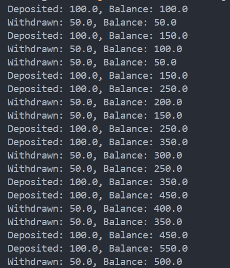
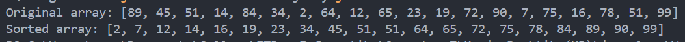

# 👩🏻‍🏫 Lecture 03 - Java Core
> This repository is created as a part of assignment for Lecture 03 - Java Core

## 🧶 Assignment 04 - Multithreading
### 💀 Task 1 - Deadlock Explanation and Prevention
#### 🤔 What is Deadlock?
A deadlock occurs in a multithreading environment when two or more threads are blocked forever, each waiting on the other to release a resource. This situation arises when the following four conditions are met simultaneously.
1. **Mutual Exclusion**: At least one resource must be held in a non-shareable mode.
2. **Hold and Wait**: A thread holding at least one resource is waiting to acquire additional resources held by other threads.
3. **No Preemption**: Resources cannot be forcibly removed from the threads holding them.
4. **Circular Wait**: A set of threads are waiting for each other in a circular chain.

#### 👉 Example of Deadlock
Here's a simple example with two threads and two locks.
```java
class Resource {
    public final String name;

    public Resource(String name) {
        this.name = name;
    }
}

public class DeadlockExample {
    public static void main(String[] args) {
        final Resource resource1 = new Resource("Resource 1");
        final Resource resource2 = new Resource("Resource 2");

        Thread t1 = new Thread(() -> {
            synchronized (resource1) {
                System.out.println("Thread 1: Locked " + resource1.name);

                try { Thread.sleep(100); } catch (InterruptedException e) {}

                synchronized (resource2) {
                    System.out.println("Thread 1: Locked " + resource2.name);
                }
            }
        });

        Thread t2 = new Thread(() -> {
            synchronized (resource2) {
                System.out.println("Thread 2: Locked " + resource2.name);

                try { Thread.sleep(100); } catch (InterruptedException e) {}

                synchronized (resource1) {
                    System.out.println("Thread 2: Locked " + resource1.name);
                }
            }
        });

        t1.start();
        t2.start();
    }
}
```

Here’s the detailed sequence of events that leads to deadlock:
1. **Initialization**: Both threads are started almost simultaneously.
2. **`Thread t1` Execution**:
    - Step 1: `Thread t1` locks `resource1` and prints "Thread 1: Locked Resource 1"
    - Step 2: `Thread t1` sleeps for 100 milliseconds while holding the lock on `resource1`.
3. **`Thread t2` Execution:**
    - Step 1: While `Thread t1` is sleeping, `Thread t2` locks `resource2` and prints "Thread 2: Locked Resource 2".
    - Step 2: `Thread t2` sleeps for 100 milliseconds while holding the lock on `resource2`.
4. **Deadlock Situation**:
    - After 100 milliseconds, both threads wake up and attempt to acquire the locks held by each other.
    - `Thread t1`: Tries to lock `resource2` but cannot proceed because `resource2` is locked by `Thread t2`.
    - `Thread t2`: Tries to lock `resource1` but cannot proceed because `resource1` is locked by `Thread t1`.
    - Both threads are now waiting indefinitely for each other to release the locks, causing a deadlock.

#### ❗ Deadlock Prevention Strategies
To prevent deadlocks, we can apply several strategies.
1. **Lock Ordering**: Always acquire locks in a predefined order. If all threads acquire locks in the same sequence, circular wait conditions cannot occur and deadlocks can be avoided.
For instance, if we always lock `resource1` before `resource2`, we can avoid the circular wait.
    ```java
    synchronized (resource1) {
        synchronized (resource2) {
            // critical section
        }
    }
    ```
2. **Timeouts**: Use timeouts for lock acquisition attempts so threads don't wait indefinitely.
    ```java
    if (lock1.tryLock(50, TimeUnit.MILLISECONDS)) {
        try {
            if (lock2.tryLock(50, TimeUnit.MILLISECONDS)) {
                try {
                    // critical section
                } finally {
                    lock2.unlock();
                }
            }
        } finally {
            lock1.unlock();
        }
    }
    ```
3. **Avoid Nested Locks**: Reduce or avoid acquiring multiple locks simultaneously. Structure the code to minimize the need for nested locking.
4. **Use `tryLock`**: Instead of waiting indefinitely, use `tryLock` with a timeout to avoid getting stuck.
5. **Detect and Recover**: Implement deadlock detection algorithms that identify and recover from deadlocks. For example, using a monitor thread to check the status of threads and locks.
6. **Use Higher-Level Concurrency Utilities**: Prefer higher-level concurrency constructs that abstract away the complexities of manual locking, like `java.util.concurrent.locks.Lock` or `java.util.concurrent.ConcurrentHashMap`.
<br>

### 🏦 Task 2 - Creating a Bank Account with Concurrent Deposits and Withdrawals Using Threads
We need to create a bank account system where multiple threads can deposit and withdraw funds concurrently. This requires handling synchronization to avoid issues such as data corruption or inconsistent account balances.

#### 🔑 Key Concepts Involved
- **Concurrency**: Multiple threads will access and modify the bank account's balance simultaneously.
- **Synchronization**: We need to ensure that access to the shared resource (the account balance) is controlled to avoid race conditions.
- **Thread Safety**: Ensuring the integrity of the account balance when multiple threads perform deposits and withdrawals.

#### ✍ Implementation Steps
Here i implement class `BankAccount` and `BankAccountDemo`.
1. **[BankAccount Class](/Week%2002%20-%20Jun%2017-21/Lecture%2003/Assignment%204/BankAccount.java)**

    The `BankAccount` class will hold the balance and provide methods for depositing and withdrawing funds. These methods must be thread-safe, meaning they should prevent multiple threads from corrupting the balance when they operate concurrently.
    - **`ReentrantLock`**: This lock ensures that only one thread can modify the balance at a time, making the deposit and withdraw methods thread-safe.
    - **`lock.lock()`**: Acquires the lock before accessing the balance.
    - **`lock.unlock()`**: Releases the lock after the operation, ensuring other threads can access the balance.
2. **[BankAccountDemo Class](/Week%2002%20-%20Jun%2017-21/Lecture%2003/Assignment%204/BankAccountDemo.java)**
    
    This class work to simulate concurrent deposits and withdrawals using multiple threads.
    - **`Runnable` Tasks**: These represent the operations that threads will execute. One task deposits money into the account, and the other withdraws money.
    - **`Thread.sleep(100)`**: Introduces a small delay to simulate processing time and to increase the likelihood of context switching between threads, which helps in testing the thread safety of the `BankAccount` methods.
    - **Starting Threads**: `depositThread` and `withdrawThread` are started, running concurrently and interacting with the shared `BankAccount` instance.

And the output of the program shows like this.



<br>

### 🔢 Task 3 - Sorts an Array of Integers Using Multiple Threads
Let’s walk through the entire process of sorting an array of random integers using multi-threading with the merge sort algorithm in Java. This involves generating the array, sorting it with multiple threads, and understanding how the merge sort algorithm is adapted to a multi-threaded environment.

1. **Generate a Random Array**
    
    The first step is to create an array of 20 random integers. We use Java's Random class to generate these numbers.
2. **Implement the Merge Sort Algorithm with Multi-threading**
    
    Merge sort is a divide-and-conquer algorithm. It divides the array into smaller subarrays, sorts them, and then merges them back together. For multi-threaded sorting, we use Java’s Fork/Join framework to handle sorting in parallel.
    - **Inheritance**: Extends `RecursiveAction`, a part of the Fork/Join framework, for parallel execution.
    - **Constructor**: Initializes the task with the array and the range to sort.
    - **`compute()`**: Implements the recursive divide-and-conquer logic. If the subarray is small, it sorts it directly using `Arrays.sort()`. Otherwise, it splits the array further and sorts the halves in parallel.
    - **`merge()`**: Merges two sorted halves into a single sorted subarray.

Detail implementation is written on [this code](/Week%2002%20-%20Jun%2017-21/Lecture%2003/Assignment%204/MultiThreadedSort.java), and the output of the program shows like this.



<br>

### 📌 Task 4 - Notable Aspects When Using Multiple Threads
#### ✅ **Advantages**
- **Improved Performance**
    - **Parallelism**: By dividing tasks among multiple threads, we can take advantage of multi-core processors to perform computations in parallel. This can lead to significant performance improvements, especially for CPU-bound tasks.
    - **Concurrent I/O**: For applications involving I/O operations (such as reading/writing files or making network requests), multiple threads can handle these operations simultaneously, reducing wait times and improving overall throughput.
- **Responsiveness**: In GUI applications, we can use background threads to perform long-running tasks (like data loading or processing) while keeping the user interface responsive. The main thread handles user interactions while background threads handle the heavy lifting.
- **Resource Sharing**
    - **Efficient Memory Use**: Threads share the same memory space, making them more efficient than processes for tasks that need to share data frequently. This shared memory space allows for fast communication between threads.
    - **Shared Resources**: Threads can easily share common resources, such as caches or buffers, reducing redundancy and memory usage.

#### 🚨 **Challenges**
- **Complexity**
    - **Code Complexity**: Multithreading introduces additional complexity in terms of managing thread interactions, synchronization, and ensuring thread safety.
    - **Difficult Debugging**: Bugs related to concurrency, such as race conditions or deadlocks, can be difficult to reproduce and diagnose due to the non-deterministic nature of thread execution.
- **Concurrency Issues**
    - **Race Conditions**: Occur when multiple threads access shared resources without proper synchronization, leading to inconsistent or incorrect results.
    - **Deadlocks**: Happen when two or more threads are blocked forever, each waiting for the other to release a lock.
    - **Thread Interference:** Threads modifying shared variables simultaneously can lead to unexpected behavior or corrupted data.
- **Overhead**
    - **Context Switching**: Switching between threads requires saving and loading context, which can lead to performance overhead if done frequently.
    - **Resource Contention**: Multiple threads competing for the same resources can lead to contention and reduced performance due to locking and synchronization overhead.

#### 📢 **Practical Considerations**
1. **Synchronization**
    - **Locks and Monitors**: Use locks (`synchronized`, `ReentrantLock`) to protect critical sections of code from concurrent access.
    - **Atomic Variables**: Use atomic classes (`AtomicInteger`, `AtomicReference`) for simple atomic operations without needing explicit synchronization.
2. **Thread Management**
    - **Thread Pools**: Use `ExecutorService` to manage a pool of threads and reuse them for executing tasks, which is more efficient than creating new threads for every task.
    - **Scheduled Tasks**: Use `ScheduledExecutorService` for tasks that need to be executed periodically or after a delay.
3. **Avoiding Common Pitfalls**
    - **Deadlock**: Follow lock ordering principles and avoid circular dependencies in lock acquisition.
    - **Livelock**: Ensure threads make progress and do not end up in a state where they continuously respond to each other without doing useful work.
    - **Resource Contention**: Minimize contention by reducing the duration for which locks are held and using appropriate synchronization mechanisms.
<br>

### 🔐 Task 5 - Using `ReadWriteLock` for Concurrent Read-Write Access
In concurrent programming, managing access to shared resources is critical. `ReadWriteLock` in Java is designed to improve performance by allowing multiple threads to read a resource simultaneously while maintaining exclusive access for writing. This mechanism is beneficial when read operations are more frequent than write operations.

#### ✨ Concepts of ReadWriteLock
1. **ReadWriteLock Interface**
    - Provides two locks: a read lock and a write lock.
    - Multiple threads can hold the read lock simultaneously if no thread holds the write lock.
    - The write lock is exclusive; only one thread can hold it, and no other thread can hold the read lock simultaneously.
2. **Usage Scenario**
    - Ideal when a shared resource is read frequently but modified infrequently.
    - Improves performance over using a regular `synchronized` block or `ReentrantLock` where all access is serialized.

#### 🧩 Components of `ReadWriteLock`
1. **Read Lock**
    - Acquired by threads that want to read the shared resource.
    - Multiple threads can hold this lock concurrently, enhancing read performance.
2. **Write Lock**
    - Acquired by threads that want to modify the shared resource.
    - Exclusive access is required, ensuring that no reads or other writes occur while a thread holds this lock.

Detail implementation is written on [this code](/Week%2002%20-%20Jun%2017-21/Lecture%2003/Assignment%204/ReadWriteLockJava.java).

Here’s what the program actually done.
1. **Shared Resource**
    - The `sharedList` is the resource that multiple threads will read from and write to.
    - A `ReentrantReadWriteLock` is used to manage access to this list.
2. **Locks**
    - `ReadWriteLock`: Created to control access.
    - `readLock` and `writeLock`: Obtained from the `ReadWriteLock` for read and write operations respectively.
3. **Write Operation**
    - The `addElement()` method acquires the writeLock before modifying the list. This ensures exclusive access.
    - After adding an element, the lock is released.
4. **Read Operation**
    - The `getElements()` method acquires the readLock to safely read the list.
    - It returns a copy of the list to prevent modification of the original list by the calling thread.
5. **Main Method**
    - Writer Runnable: Adds elements to the list. Runs in its own thread.
    - Reader Runnable: Reads the list contents. Multiple readers run in their own threads.
    - The writer thread adds numbers 1 through 5 to the list.
    - Two reader threads repeatedly read and print the list contents.

The output of the program shows like this.


<br>