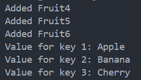
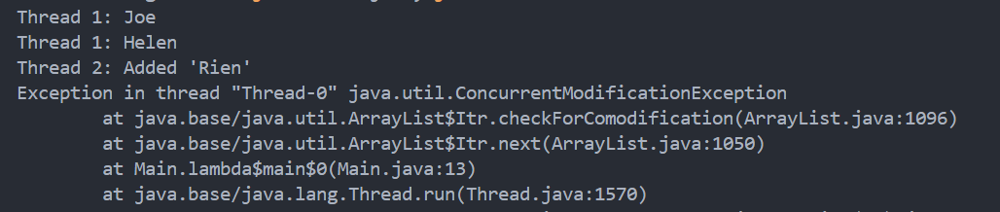

# 👩🏻‍🏫 Lecture 03 - Java Core
> This repository is created as a part of assignment for Lecture 03 - Java Core

## 📚 Assignment 05 - Java Collections
### 🔍 Task 1 - Collection Comparison
#### 🆚 ArrayList vs. LinkedList
| Aspects | `ArrayList` | `LinkedList` |
| ---- | ---- | ---- |
| Order | Maintains the insertion order. | Maintains the insertion order. |
| Null elements | Allows null elements. | Allows null elements. |
| Performance (Access) | `O(1)` – ArrayList has a backing array, providing constant time access to any element by index.| `O(n)` – Traverses the list from the start or end, making access time linear. |
| Performance (Insert) | `O(1)` amortized – Appends to the end are usually constant time, but inserting in the middle requires shifting elements, making it `O(n)` in the worst case. | `O(1)` – Insertion at the beginning or end is constant time. |
| Performance (Remove) | `O(n)` – Removing an element requires shifting elements to fill the gap. | `O(1)` – Removal of the first or last element is constant time; otherwise, it’s `O(n)`. |
| Performance (Memory) | Automatic resizing involves copying elements to a new array, which is `O(n)` when it happens. | Requires more memory per element than `ArrayList` due to storage for node pointers. |
| Synchronized | Not synchronized by default. Use `Collections.synchronizedList` for thread safety. | Not synchronized by default. Use `Collections.synchronizedList` for thread safety. |
| Fail-Fast Iterators | Iterators throw `ConcurrentModificationException` if the list is modified during iteration. | Iterators throw `ConcurrentModificationException` if the list is modified during iteration. |

#### ❓ When to Use?
- `ArrayList`: Prefer when we need fast access by index and infrequent insertions/removals.
- `LinkedList`: Prefer when we have frequent insertions/removals and do not require fast access by index.

#### 🆚 HashSet vs. TreeSet vs. LinkedHashSet
| Aspects | `HashSet` | `TreeSet` | `LinkedHashSet` |
| ---- | ---- | ---- | --- |
| Order | No guaranteed order. | Maintains a sorted order based on natural ordering or a comparator. | Maintains insertion order. |
| Null elements | Allows a single null element. | Does not allow null elements. | Allows a single null element. |
| Performance (Insert) | `O(1)` – Constant time for most operations. | `O(log n)` – Elements are added while maintaining  order. | `O(1)` – Constant time while maintaining insertion order. |
| Performance (Search) | `O(1)` – Efficient hashing gives constant time on average. | `O(log n)` – Efficient searching as it is based on binary search trees. | `O(1)` – Efficient hashing gives constant time on average. |
| Performance (Remove) | `O(1)` – Constant time on average. | `O(log n)` – Removal is also logarithmic due to rebalancing. | `O(1)` – Constant time on average. |
| Synchronized | Not synchronized. Use `Collections.synchronizedSet` for thread safety. | Not synchronized. Use `Collections.synchronizedSortedSet` for thread safety. | Not synchronized. Use `Collections.synchronizedSet` for thread safety. |

#### ❓ When to Use?
- `HashSet`: Prefer for the best performance when order doesn’t matter.
- `TreeSet`: Use when we need a sorted set.
- `LinkedHashSet`: Use when we need a set that maintains insertion order.
<br>

### 🧩 Task 2 - Retrieve an Element from an ArrayList
In Java, we can retrieve an element from an `ArrayList` by using the `get()` method. The `ArrayList` class is part of the `java.util package` and allows for dynamic arrays that can grow as needed.

Here’s how we can retrieve an element at a specified index:
1. Creating an `ArrayList`: First, we create an `ArrayList` and populate it with elements.
2. Accessing Elements: We use the `get()` method provided by the `ArrayList` class to retrieve the element at the desired index.
3. Handling Index Validity: It's important to check if the index is within the valid range (from `0` to `size()-1`) to avoid `IndexOutOfBoundsException`.

```java
import java.util.ArrayList;

public class RetrieveElement {
    public static void main(String[] args) {
        // Create an ArrayList and add some elements
        ArrayList<String> list = new ArrayList<>();
        list.add("Apple");
        list.add("Banana");
        list.add("Cherry");
        list.add("Date");

        // Specify the index to retrieve
        int index = 2;

        // Retrieve the element at the specified index
        if (index >= 0 && index < list.size()) {
            String element = list.get(index);
            System.out.println("Element at index " + index + ": " + element);
            // Output: Element at index 2: Cherry
        } else {
            System.out.println("Index out of bounds.");
        }
    }
}
```
<br>

### 🧹 Task 3 - Removing Duplicate Lines by Key Field from a File
#### 📝 Procedure
To remove duplicate lines from a file:
1. **Reading the File**: Read the content of the file line by line.
2. **Identifying Key Field**: Determine which field in each line will serve as the key for identifying duplicates.
3. **Using a Set for Uniqueness**: Use a `HashSet` to track keys of lines that have already been encountered.
4. **Writing Unique Lines**: Write only those lines to a new file that haven't been seen before (not in the `HashSet`).

#### 📋 Case CSV Content
In this program, i use CSV file [`input.csv`](/Week%2002%20-%20Jun%2017-21/Lecture%2003/Assignment%205/data/input.csv) with content like this.
```csv
employeeID,name,department
1,Alice,HR
2,Bob,IT
3,Bono,QA
3,Charlie,Finance
4,Daniel,IT
5,Eve,HR
5,Edward,Marketing
2,Leo,HR
```
In this case, we want to remove duplicate lines based on the `employeeID` field.

#### 💻 Final Program
Detail implementation is written on [this code](/Week%2002%20-%20Jun%2017-21/Lecture%2003/Assignment%205/RemoveDuplicates.java). Here’s what the program actually done.
1. **File Handling**: `BufferedReader` is used to read from `input.csv`, and `PrintWriter` is used to write to `output.csv`.
2. **HashSet (`seenKeys`)**: This set keeps track of keys (`employeeID`) that have already been encountered. This allows us to efficiently check for duplicates.
3. **Processing Each Line**:
    - Each line is split into fields using `line.split(delimiter)`.
    - The first field (`fields[0]`) is considered the key (`employeeID`).
    - If the key is not in `seenKeys`, it means the line hasn't been encountered before, so it's written to `output.csv` and added to `seenKeys`.
4. **Output**: After processing all lines, the program prints a success message indicating that duplicates have been removed and the output file (`output.csv`) has been created.

The output of the program shows on this [`output.csv`](/Week%2002%20-%20Jun%2017-21/Lecture%2003/Assignment%205/data/output.csv)

<br>

### 🖨️ Task 4 - Get a Shallow Copy of a `HashMap`
A shallow copy of a `HashMap` means creating a new `HashMap` instance that has the same key-value pairs as the original. Changes to the new map won’t affect the original map, but changes to the objects (if they are mutable) that the map’s keys or values refer to will affect both maps.

For example, Imagine we have a `HashMap` that maps employee IDs to employee objects. We want to create a copy of this `HashMap` for some operation without affecting the original map.

```java
import java.util.HashMap;

public class ShallowCopyHashMap {
    public static void main(String[] args) {
        // Original HashMap
        HashMap<Integer, String> originalMap = new HashMap<>();
        originalMap.put(1, "Alice");
        originalMap.put(2, "Bob");
        originalMap.put(3, "Charlie");

        // Creating a shallow copy using the copy constructor
        HashMap<Integer, String> copyMap = new HashMap<>(originalMap);

        // Adding an element to the original map
        originalMap.put(4, "David");

        // Displaying both maps
        System.out.println("Original HashMap: " + originalMap);
        // Output: Original HashMap: {1=Alice, 2=Bob, 3=Charlie, 4=David}
        System.out.println("Shallow Copy HashMap: " + copyMap);
        // Output: Shallow Copy HashMap: {1=Alice, 2=Bob, 3=Charlie}
    }
}
```
Here’s what the program actually done.
1. **HashMap Initialization**: `HashMap<Integer, String> originalMap = new HashMap<>();` creates a `HashMap` that maps `Integer` keys (employee IDs) to `String` values (employee names).
2. **Populating the HashMap**: `originalMap.put(...);` adds key-value pairs to the `originalMap`.
3. **Creating a Shallow Copy**: `HashMap<Integer, String> copyMap = new HashMap<>(originalMap);`
The copy constructor `new HashMap<>(originalMap)` creates a new `HashMap` (`copyMap`) containing the same mappings as `originalMap`.
4. **Modifying the Original Map**: `originalMap.put(4, "David");` adds a new entry to `originalMap` after creating the copy.
5. **Output**: The program prints both `originalMap` and `copyMap`. Since it's a shallow copy, modifying `originalMap` (`put(4, "David")`) affects only `originalMap`, not `copyMap`.

Besides using the copy constructor, we can also use the `putAll()` method to copy the contents of one `HashMap` into anothe.
```java
// Alternative method using putAll() for shallow copy
HashMap<Integer, String> copyMap = new HashMap<>();
copyMap.putAll(originalMap);
```
Both approaches achieve the same result, which is a shallow copy of the `HashMap`.

<br>

### 🔀 Task 5 - Converting List to Map in Java
Imagine we have a `List` of `Employee` objects, and each `Employee` has a unique `employeeID`. We want to convert this `List` into a `Map` where each `employeeID` acts as the key, and the corresponding `Employee` object is the value in the map.

#### ✍ Implementation Steps
Here i implement class `BankAccount` and `BankAccountDemo`.
1. **Create a `List` of Objects**: Populate a `List` with objects (Employee objects in this case).
2. **Define a Key Mapper Function**: Decide how we want to map each object to its key. In our case, it's the `employeeID` of each `Employee`.
3. **Use Java Streams for Transformation**: Utilize Java Streams API to transform the `List` into a `Map`.
4. **Collect into Map**: Use the `Collectors.toMap()` method to collect elements of the `List` into a `Map` using the specified key and value mappings.

Detail implementation is written on [this code](/Week%2002%20-%20Jun%2017-21/Lecture%2003/Assignment%205/ListToMap.java), and the output of the program shows like this.


<br>

### ⚡ Task 6 - Demo `CopyOnWriteArrayList`
`CopyOnWriteArrayList` is a thread-safe variant of `ArrayList` in which all mutative operations (`add`, `set`, etc.) are implemented by making a fresh copy of the underlying array. It is useful in scenarios where reads are more frequent than writes.

Here is the code example.
```java
import java.util.concurrent.CopyOnWriteArrayList;

public class COWArrayListDemo {
    public static void main(String[] args) {
        // Create a CopyOnWriteArrayList
        CopyOnWriteArrayList<Integer> numbers = new CopyOnWriteArrayList<>();
        
        // Add elements to the list
        numbers.add(1);
        numbers.add(2);
        numbers.add(3);
        
        // Print initial list
        System.out.println("Initial List: " + numbers);
        
        // Iterate over the list and modify it
        for (Integer number : numbers) {
            System.out.println("Current Element: " + number);
            numbers.add(number + 10); // Modify the list by adding 10 to each element
        }
        
        // Print modified list
        System.out.println("Modified List: " + numbers);
    }
}
```

Detail implementation is written on [this code](/Week%2002%20-%20Jun%2017-21/Lecture%2003/Assignment%205/COWArrayListDemo.java), and the output of the program shows like this.


<br>

### 🔗 Task 7 - Demo `ConcurrentHashMap`
`ConcurrentHashMap` is a thread-safe version of `HashMap` that allows concurrent access to different segments of the map. This allows for high throughput in concurrent environments.

Here is the code example.
```java
import java.util.concurrent.ConcurrentHashMap;

public class ConcurrentHashMapDemo {
    public static void main(String[] args) {
        ConcurrentHashMap<Integer, String> map = new ConcurrentHashMap<>();
        map.put(1, "Apple");
        map.put(2, "Banana");
        map.put(3, "Cherry");

        // Accessing map concurrently
        Runnable task1 = () -> {
            for (int i = 4; i <= 6; i++) {
                map.put(i, "Fruit" + i);
                System.out.println("Added Fruit" + i);
            }
        };

        Runnable task2 = () -> {
            for (int i = 1; i <= 3; i++) {
                System.out.println("Value for key " + i + ": " + map.get(i));
            }
        };

        Thread thread1 = new Thread(task1);
        Thread thread2 = new Thread(task2);

        thread1.start();
        thread2.start();
    }
}
```

Detail implementation is written on [this code](/Week%2002%20-%20Jun%2017-21/Lecture%2003/Assignment%205/ConcurrentHashMapDemo.java), and the output of the program shows like this.



<br>

### 🟰 Task 8 - `equals()` and `hashCode()` methods
#### ➡️ `equals()` method
The `equals()` method is used to compare two objects for equality. In the `Object` class, which all classes in Java inherit, `equals()` checks if two references point to the same object (`this == obj`). However, this default behavior is often inadequate when we need logical equality (i.e., comparing contents).

#### 🗝️ Key Points
- **Purpose**: Determine logical equality between two objects.
- **Signature**: `public boolean equals(Object obj)`
- **Default Behavior**: Reference equality.
- **Override**: Needed for logical equality based on object data.

#### 📝 Contract for `equals()`
- **Reflexive**: `x.equals(x)` is always true.
- **Symmetric**: `x.equals(y)` if and only if `y.equals(x)`.
- **Transitive**: If `x.equals(y)` and `y.equals(z)`, then `x.equals(z)`.
- **Consistent**: Multiple invocations return true or false consistently, provided no information used in equals comparisons is modified.
- **Non-nullity**: `x.equals(null)` is always false.

#### 💡 Example
Suppose we have an `Employee` class and we want to compare employees based on their `id`.

```java
public class Employee {
    private int id;
    private String name;

    // Constructor
    public Employee(int id, String name) {
        this.id = id;
        this.name = name;
    }

    @Override
    public boolean equals(Object obj) {
        if (this == obj) return true;
        if (obj == null || getClass() != obj.getClass()) return false;
        Employee employee = (Employee) obj;
        return id == employee.id; // Comparison based on 'id' field
    }
}
```

In this example, two `Employee` objects are considered equal if their `id` values are the same.

#### ➡️ `hashCode()` method
The `hashCode()` method returns an integer hash code value for the object. This value is used by hash-based collections like `HashMap`, `HashSet`, etc., to store and retrieve objects efficiently.

#### 🗝️ Key Points
- **Purpose**: Provide a hash code to support hash-based collections.
- **Signature**: `public int hashCode()`.
- **Default Behavior**: Converts the memory address of the object to an integer.
- **Override**: Needed for consistent hashing when `equals()` is overridden.

#### 📝 Contract for `hashCode()`
- **Consistency**: Multiple invocations must consistently return the same value if no object information used in equals comparisons is modified.
- **Equal Objects**: If `x.equals(y)`, then `x.hashCode()` must be the same as `y.hashCode()`.
- **Unequal Objects**: It's not mandatory, but ideally, different objects should produce different hash codes to reduce hash collisions.

#### 💡 Example
Continuing with the `Employee` class, we'll override `hashCode()` to return a hash based on the `id`.

```java
public class Employee {
    private int id;
    private String name;

    // Constructor
    public Employee(int id, String name) {
        this.id = id;
        this.name = name;
    }

    @Override
    public boolean equals(Object obj) {
        if (this == obj) return true;
        if (obj == null || getClass() != obj.getClass()) return false;
        Employee employee = (Employee) obj;
        return id == employee.id; // Comparison based on 'id' field
    }

    @Override
    public int hashCode() {
        return Objects.hash(id); // Hash based on 'id' field
    }
}
```

In this example, `Objects.hash(id)` generates a hash code using the `id` field. This ensures that equal `Employee` objects (those with the same `id`) have the same hash code.

#### 📌 Best Practices
1. **Use the Same Fields**: Ensure `equals()` and `hashCode()` use the same fields to compare and compute the hash code.
2. **Use `Objects.hash()`**: Simplifies the implementation of `hashCode()`.
3. **Avoid Transient Fields**: Do not use transient fields in `equals()` and `hashCode()` as they might not contribute to logical equality.
4. **Follow the Contract**: Ensure compliance with the contracts of `equals()` and `hashCode()`.
5. **Must be consistent**: If `hashCode()` is not consistent with `equals()`, collections like `HashSet` might not work correctly, leading to unexpected behavior, such as failing to find an object or treating distinct objects as duplicates.
6. **Use Lombok**: Using can simplify the process by annotating your class with `@EqualsAndHashCode`

    ```java
    import lombok.EqualsAndHashCode;

    @EqualsAndHashCode
    public class Employee {
        private int id;
        private String name;

        // Constructor, getters, setters
    }
    ```

<br>

### 🤔 Task 9 - Recognizing Duplicate Employees by ID in a `HashSet`
A `HashSet` in Java is a collection that does not allow duplicate elements. To recognize duplicates, `HashSet` relies on the `equals()` and `hashCode()` methods of the objects it contains. Therefore, to add employees to a `HashSet` and recognize duplicates based on employee ID, we must override `equals()` and `hashCode()` in the `Employee` class.

#### ❓ Why `HashSet` Needs `equals()` and `hashCode()`?
- **`hashCode()`**: Determines the bucket location in the underlying hash table.
- **`equals()`**: Used to compare objects for equality when they end up in the same bucket.

When you add an object to a `HashSet`, it first calculates the object's hash code to determine which bucket to check. If there is more than one object in that bucket, it uses `equals()` to check if the object already exists in the set.

#### 👨🏻‍💻 Implementation
Detail implementation is written on [this code](/Week%2002%20-%20Jun%2017-21/Lecture%2003/Assignment%205/Employee.java). Given the input of the main like this, and the output will be something like what i commented.

```java
import java.util.HashSet;
import java.util.Set;

public class EmployeeHashSet {
    public static void main(String[] args) {
        // Create a HashSet to store Employee objects
        Set<Employee> employees = new HashSet<>();

        // Create Employee objects
        Employee e1 = new Employee(1, "Alice");
        Employee e2 = new Employee(2, "Bob");
        Employee e3 = new Employee(1, "Charlie"); // Same ID as e1

        // Add employees to the HashSet
        employees.add(e1);
        employees.add(e2);
        employees.add(e3);  // This will not be added as e1 and e3 are considered equal

        // Print the HashSet size and contents
        System.out.println("HashSet size: " + employees.size()); // Output: 2
        System.out.println(employees); // Output: [Employee{id=1, name='Alice'}, Employee{id=2, name='Bob'}]
    }
}
```

<br>

### 🤝 Task 10 - Creating a Map with Composite Key (Department, EmployeeID)
To create a `Map` where the key is a combination of `department` and `employeeID`, we need to define a composite key class. This class should properly override `equals()` and `hashCode()` methods to ensure that each combination of `department` and `employeeID` is unique and can be used as a key in the map.

#### 👨🏻‍💻 Implementing the Composite Key
The composite key class will encapsulate the `department` and `employeeID` fields. By overriding `equals()` and `hashCode()`, the Map can handle this composite key correctly.

Detail implementation is written on [this code](/Week%2002%20-%20Jun%2017-21/Lecture%2003/Assignment%205/EmployeeComposite.java). Given the input of the main like this, and the output will be something like what i commented.

```java
import java.util.HashMap;
import java.util.Map;

public class EmployeeComposite {
    public static void main(String[] args) {
        // Create a Map with EmployeeKey as key and Employee as value
        Map<EmployeeKey, Employee> employeeMap = new HashMap<>();

        // Create Employee and EmployeeKey objects
        EmployeeKey key1 = new EmployeeKey("HR", 101);
        Employee e1 = new Employee(101, "Alice");

        EmployeeKey key2 = new EmployeeKey("Finance", 102);
        Employee e2 = new Employee(102, "Bob");

        EmployeeKey key3 = new EmployeeKey("HR", 103);
        Employee e3 = new Employee(103, "Charlie");

        // Add employees to the map
        employeeMap.put(key1, e1);
        employeeMap.put(key2, e2);
        employeeMap.put(key3, e3);

        // Retrieve and print employees
        System.out.println("Employees in HR department:");
        for (Map.Entry<EmployeeKey, Employee> entry : employeeMap.entrySet()) {
            if ("HR".equals(entry.getKey().getDepartment())) {
                System.out.println(entry.getValue());
            }
        }
        // Output:
        // Employees in HR department:
        // Employee{id=101, name='Alice'}
        // Employee{id=103, name='Charlie'}

        // Find a specific employee
        EmployeeKey searchKey = new EmployeeKey("Finance", 102);
        Employee foundEmployee = employeeMap.get(searchKey);
        System.out.println("Employee found: " + foundEmployee); // Output: Employee found: Employee{id=102, name='Bob'}
    }
}
```

<br>

### 🚀 Task 11 - Analyzing and Fixing the Code
Given this code snippet.
```java
public static void demo() {
    List<String> data = new ArrayList<>();
    data.add("Joe");
    data.add("Helen");
    data.add("Test");
    data.add("Test");
    data.add("Rien");
    data.add("Ruby");

    for (String d : data) {
        if (d.equals("Test")) {
            data.remove(d);
        }
    }
}

```
The above code will throw a `ConcurrentModificationException` because it tries to modify the `ArrayList` while iterating over it using a `for-each` loop.

In Java, when you use a `for-each` loop (enhanced for-loop) to iterate over a collection, modifying the collection during iteration can lead to `ConcurrentModificationException`. This is because the iterator's internal state becomes inconsistent with the collection's state.

#### 🛠️ Fixing the Issue
To safely remove elements from a collection while iterating, you can use one of the following approaches:
1. Using `Iterator` Directly
2. Using `removeIf` Method (Java 8 and later)
3. Using a `ListIterator` for Lists

##### Approach 1: Using Iterator Directly
By using an `Iterator`, we can safely remove elements during iteration.
```java
import java.util.ArrayList;
import java.util.Iterator;
import java.util.List;

public class Main {
    public static void demo() {
        List<String> data = new ArrayList<>();
        data.add("Joe");
        data.add("Helen");
        data.add("Test");
        data.add("Test");
        data.add("Rien");
        data.add("Ruby");

        // Using Iterator to remove elements safely
        Iterator<String> iterator = data.iterator();
        while (iterator.hasNext()) {
            String d = iterator.next();
            if (d.equals("Test")) {
                iterator.remove(); // Safe removal
            }
        }

        // Print the result to verify
        System.out.println(data); // Output: [Joe, Helen, Rien, Ruby]
    }

    public static void main(String[] args) {
        demo();
    }
}
```

##### Approach 2: Using `removeIf` Method (Java 8 and later)
Java 8 introduced the `removeIf` method for collections, allowing for a more concise way to remove elements.
```java
import java.util.ArrayList;
import java.util.List;

public class Main {
    public static void demo() {
        List<String> data = new ArrayList<>();
        data.add("Joe");
        data.add("Helen");
        data.add("Test");
        data.add("Test");
        data.add("Rien");
        data.add("Ruby");

        // Using removeIf to remove elements
        data.removeIf(d -> d.equals("Test"));

        // Print the result to verify
        System.out.println(data); // Output: [Joe, Helen, Rien, Ruby]
    }

    public static void main(String[] args) {
        demo();
    }
}
```

##### Approach 3: Using a `ListIterator` for Lists
When dealing with lists, `ListIterator` provides more control, including the ability to remove elements.
```java
import java.util.ArrayList;
import java.util.List;
import java.util.ListIterator;

public class Main {
    public static void demo() {
        List<String> data = new ArrayList<>();
        data.add("Joe");
        data.add("Helen");
        data.add("Test");
        data.add("Test");
        data.add("Rien");
        data.add("Ruby");

        // Using ListIterator to remove elements
        ListIterator<String> listIterator = data.listIterator();
        while (listIterator.hasNext()) {
            String d = listIterator.next();
            if (d.equals("Test")) {
                listIterator.remove(); // Safe removal
            }
        }

        // Print the result to verify
        System.out.println(data); // Output: [Joe, Helen, Rien, Ruby]
    }

    public static void main(String[] args) {
        demo();
    }
}
```

#### ✨ Detailed Explanation
1. Using `Iterator` Directly:
    - Obtain an `Iterator` from the list using `iterator()`.
    - Use `iterator.next()` to get the next element.
    - Use `iterator.remove()` to safely remove the current element.
2. Using `removeIf`:
    - Call `removeIf` on the list with a lambda expression that specifies the condition for removal.
    - This method is concise and readable but requires Java 8 or later.
3. Using `ListIterator`:
    - Obtain a `ListIterator` from the list using `listIterator()`.
    - Use `listIterator.next()` to iterate through the list.
    - Use `listIterator.remove()` to remove elements safely.
    `ListIterator` can traverse in both directions and allows adding and removing elements.

<br>

### 👌 Task 12 - Handling Concurrent Access in Java
When multiple threads access and modify a collection concurrently without proper synchronization, several issues can arise, including.
1. **Inconsistent State**: The collection may end up in an inconsistent state, with lost updates or corrupted data.
2. **`ConcurrentModificationException`**: This exception can be thrown when a thread tries to modify a collection while another thread is iterating over it, using standard non-concurrent collections like `ArrayList`, `HashSet`, etc.

`ConcurrentModificationException` is often encountered during concurrent access to collections because these collections are not designed for concurrent modification. This exception is a fail-fast mechanism to signal that the collection's structure has been modified while it is being iterated.

Here’s a simple example that demonstrates `ConcurrentModificationException`.

```java
import java.util.ArrayList;
import java.util.List;

public class Main {
    public static void main(String[] args) {
        List<String> data = new ArrayList<>();
        data.add("Joe");
        data.add("Helen");
        data.add("Test");

        // Starting a thread that iterates over the list
        new Thread(() -> {
            for (String item : data) {
                System.out.println("Thread 1: " + item);
                try {
                    Thread.sleep(50); // Sleep to simulate work
                } catch (InterruptedException e) {
                    Thread.currentThread().interrupt();
                }
            }
        }).start();

        // Starting another thread that modifies the list
        new Thread(() -> {
            try {
                Thread.sleep(100); // Sleep to ensure the other thread starts iterating
            } catch (InterruptedException e) {
                Thread.currentThread().interrupt();
            }
            data.add("Rien"); // Modifying the list
            System.out.println("Thread 2: Added 'Rien'");
        }).start();
    }
}
```

and the output of the program shows like this.



In this example, Thread 1 iterates over the list, and Thread 2 modifies the list concurrently, leading to a `ConcurrentModificationException`.

#### 🛠️ Fixing the Issue
There are several ways to safely handle concurrent modifications:
1. Synchronization
2. Concurrent Collections
3. Using `java.util.concurrent` Utilities

##### Approach 1: Synchronization
Using `synchronized` blocks or methods ensures that only one thread can access the collection at a time.

```java
import java.util.ArrayList;
import java.util.Collections;
import java.util.List;

public class Main {
    public static void main(String[] args) {
        List<String> data = Collections.synchronizedList(new ArrayList<>());
        data.add("Joe");
        data.add("Helen");
        data.add("Test");

        // Iterating with synchronization
        new Thread(() -> {
            synchronized (data) {
                for (String item : data) {
                    System.out.println("Thread 1: " + item);
                    try {
                        Thread.sleep(50);
                    } catch (InterruptedException e) {
                        Thread.currentThread().interrupt();
                    }
                }
            }
        }).start();

        // Modifying with synchronization
        new Thread(() -> {
            try {
                Thread.sleep(100);
            } catch (InterruptedException e) {
                Thread.currentThread().interrupt();
            }
            synchronized (data) {
                data.add("Rien");
                System.out.println("Thread 2: Added 'Rien'");
            }
        }).start();
    }
}
```

**Key Points**
1. **`Collections.synchronizedList**`: Wraps the list to make all method calls synchronized.
2. **`synchronized` Block**: Ensures mutual exclusion during iteration and modification.

##### Approach 2: Concurrent Collections
Java provides concurrent collections that are designed for safe concurrent access without the need for external synchronization. Common Concurrent Collections is `ConcurrentHashMap`, `CopyOnWriteArrayList`, and `ConcurrentLinkedQueue`

```java
import java.util.concurrent.CopyOnWriteArrayList;

public class Main {
    public static void main(String[] args) {
        CopyOnWriteArrayList<String> data = new CopyOnWriteArrayList<>();
        data.add("Joe");
        data.add("Helen");
        data.add("Test");

        // Iterating safely without additional synchronization
        new Thread(() -> {
            for (String item : data) {
                System.out.println("Thread 1: " + item);
                try {
                    Thread.sleep(50);
                } catch (InterruptedException e) {
                    Thread.currentThread().interrupt();
                }
            }
        }).start();

        // Modifying safely without additional synchronization
        new Thread(() -> {
            try {
                Thread.sleep(100);
            } catch (InterruptedException e) {
                Thread.currentThread().interrupt();
            }
            data.add("Rien");
            System.out.println("Thread 2: Added 'Rien'");
        }).start();
    }
}
```

**Key Points**
1. **`CopyOnWriteArrayList`**: Creates a new copy of the underlying array for each modification. Suitable for scenarios where reads vastly outnumber writes.
2. **`ConcurrentHashMap`**: Provides thread-safe operations for concurrent access.

##### Approach 3: Using `java.util.concurrent` Utilities
The `java.util.concurrent` package provides utilities for managing concurrent access.

```java
import java.util.concurrent.ConcurrentHashMap;
import java.util.Map;

public class Main {
    public static void main(String[] args) {
        Map<String, String> data = new ConcurrentHashMap<>();
        data.put("Joe", "A");
        data.put("Helen", "B");
        data.put("Test", "C");

        // Iterating safely
        new Thread(() -> {
            for (Map.Entry<String, String> entry : data.entrySet()) {
                System.out.println("Thread 1: " + entry);
                try {
                    Thread.sleep(50);
                } catch (InterruptedException e) {
                    Thread.currentThread().interrupt();
                }
            }
        }).start();

        // Modifying safely
        new Thread(() -> {
            try {
                Thread.sleep(100);
            } catch (InterruptedException e) {
                Thread.currentThread().interrupt();
            }
            data.put("Rien", "D");
            System.out.println("Thread 2: Added 'Rien'");
        }).start();
    }
}
```

#### ⚡ Comparisons of Approaches
1. **Synchronization**
    - **Pros**: Simplicity, works with any collection.
    - **Cons**: Can lead to contention and decreased performance due to blocking.
2. **Concurrent Collections**
    - **Pros**: Designed for concurrency, better performance with less blocking.
    - **Cons**: Higher memory usage (e.g., `CopyOnWriteArrayList`).
3. **`java.util.concurrent` Utilities**
    - **Pros**: Provide higher-level concurrency control mechanisms.
    - **Cons**: Can be complex for some use cases.