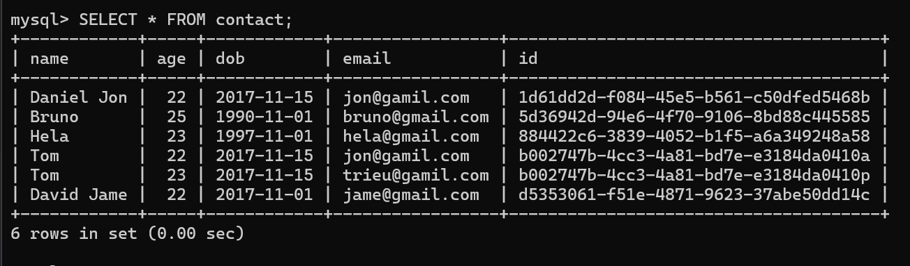

# 👨🏻‍🏫 Lecture 05 - Basic Backend, Spring
> This repository is created as a part of assignment for Lecture 05 - Basic Backend, Spring

## 🔎 Assignment 01 - Practice the Example
### 🌳 Project Structure
```bash
lecture_5
├── .mvn/wrapper/
│   └── maven-wrapper.properties
├── src/main/
│   ├── java/com/example/lecture_5_hw/
│   │   ├── controller/
│   │   │   └── ContactController.java
│   │   ├── model/
│   │   │   └── Contact.java
│   │   ├── repository/
│   │   │   └── ContactRepository.java
│   │   └── Lecture5Application.java
│   └── resources/
│       └── application.properties
├── .gitignore
├── mvnw
├── mvnw.cmd
├── pom.xml
├── run.bat
└── run.sh
```

### 🧩 SQL Query Data
Here is the SQL query to create the database, table, and instantiate some data, given by the [reference repository](https://github.com/NguyenVanTrieu/spring-crud).
```sql
-- Create the database
CREATE DATABASE week3_lecture5;

-- Use the database
USE week3_lecture5;

-- Create the contact table
CREATE TABLE `contact` (
           `name` varchar(100) COLLATE utf8mb4_unicode_ci NOT NULL,
           `age` int(3) NOT NULL,
           `dob` date NOT NULL,
           `email` varchar(100) COLLATE utf8mb4_unicode_ci NOT NULL,
           `id` varchar(50) NOT NULL
) ENGINE=InnoDB DEFAULT CHARSET=utf8mb4 COLLATE=utf8mb4_unicode_ci;


ALTER TABLE `contact`
    ADD PRIMARY KEY (`id`);

-- Insert dummy data into the contact table
INSERT INTO `contact` (`name`, `age`, `dob`, `email`, `id`) VALUES
('Daniel Jon', 22, '2017-11-15', 'jon@gamil.com', "1d61dd2d-f084-45e5-b561-c50dfed5468b"),
('David Jame', 22, '2017-11-01', 'jame@gmail.com', "d5353061-f51e-4871-9623-37abe50dd14c"),
('Hela', 23, '1997-11-01', 'hela@gmail.com', "884422c6-3839-4052-b1f5-a6a349248a58"),
('Bruno', 25, '1990-11-01', 'bruno@gmail.com', "5d36942d-94e6-4f70-9106-8bd88c445585");
```

and here is the query to drop the database
```sql
-- Drop the database
DROP DATABASE IF EXISTS week3_lecture5;
```

### ⚙️ How to run the program
1. Go to the `lecture_5` directory by using this command
    ```bash
    $ cd lecture_5
    ```
2. Make sure you have maven installed on your computer, use `mvn -v` to check the version.
3. If you are using windows, you can run the program by using this command.
    ```bash
    $ ./run.bat
    ```
    And if you are using Linux, you can run the program by using this command.
    ```bash
    $ chmod +x run.sh
    $ ./run.sh
    ```

If all the instruction is well executed, the main-view will be something like this.


### 📸 Screenshots
Here is some result of the APIs created. based on the postman collection with slight modification.
<br>
#### Initial state


1. **Get All Contacts** 
    `(GET /api/v1/contact)`

    
2. **Get Contact By ID**
    `(GET /api/v1/contact/b002747b-4cc3-4a81-bd7e-e3184da0410a)`

    
3. **Add New Contact**
    `(POST /api/v1/contact)`
    
    Body (Raw):
    ```json
    {
        "name": "Trieu",
        "dob": "2017-11-14T17:00:00.000+00:00",
        "age": 22,
        "email": "trieu@gamil.com",
        "id": "b002747b-4cc3-4a81-bd7e-e3184da0410p"
    }
    ```

    
    
4. **Edit Contact**
    `(PUT /api/v1/contact/b002747b-4cc3-4a81-bd7e-e3184da0410p)`
    
    Body (Raw):
    ```json
    {
        "name": "Tom",
        "dob": "2017-11-14T17:00:00.000+00:00",
        "age": 23,
        "email": "jon@gmail.com"
    }
    ```

    
    