# 👨🏻‍🏫 Lecture 05 - Basic Backend, Spring
> This repository is created as a part of assignment for Lecture 05 - Basic Backend, Spring

## ✍🏼 Assignment 02 - CRUD Project for Employee Management
### 🌳 Project Structure
```bash
lecture_5_hw
├── .mvn/wrapper/
│   └── maven-wrapper.properties
├── src/main/
│   ├── java/com/example/lecture_5_hw/
│   │   ├── controller/
│   │   │   └── EmployeeController.java
│   │   ├── data/
│   │   │   └── ImportData.csv
│   │   ├── model/
│   │   │   └── Employee.java
│   │   ├── repository/
│   │   │   └── EmployeeRepository.java
│   │   ├── utils/
│   │   │   ├── DateUtils.java
│   │   │   └── FileUtils.java
│   │   └── Lecture5HwApplication.java
│   └── resources/
│       └── application.properties
├── .gitignore
├── mvnw
├── mvnw.cmd
├── pom.xml
├── run.bat
└── run.sh
```

### 🧩 SQL Query Data
Here is the SQL query to create the database, table, and instantiate some data
```sql
-- Create the database
CREATE DATABASE week3_lecture5_hw;

-- Use the database
USE week3_lecture5_hw;

-- Create the employee table
CREATE TABLE `employee` (
    `id` VARCHAR(50) NOT NULL,
    `name` VARCHAR(100) COLLATE utf8mb4_unicode_ci NOT NULL,
    `dob` DATE NOT NULL,
    `address` VARCHAR(255) NOT NULL,
    `department` VARCHAR(100) NOT NULL,
    PRIMARY KEY (id)
);

-- Insert dummy data into the employee table
INSERT INTO Employee (id, name, dob, address, department) VALUES
('1caa1b8e-678c-41a2-9d91-234f1d75f777', 'Alice Johnson', '1985-05-15', '123 Elm Street, Springfield', 'WEB'),
('2bff2b8f-789d-41b3-9e92-345f2d86f888', 'Bob Smith', '1979-12-22', '456 Oak Avenue, Springfield', 'SYSTEM'),
('3ccd3c90-890e-41c4-9fa3-456f3d97f999', 'Carol Davis', '1990-08-12', '789 Pine Road, Springfield', 'MOBILE'),
('4dde4d91-901f-41d5-9fb4-567f4e08faaa', 'David Wilson', '1988-07-04', '321 Maple Street, Springfield', 'QA'),
('5eef5e92-0120-41e6-9fc5-678f5e19fbbb', 'Eva Brown', '1992-03-28', '654 Birch Lane, Springfield', 'ADMIN');
```

and here is the query to drop the database
```sql
-- Drop the database
DROP DATABASE IF EXISTS week3_lecture5_hw;
```

### ⚙️ How to run the program
1. Go to the `lecture_5_hw` directory by using this command
    ```bash
    $ cd lecture_5_hw
    ```
2. Make sure you have maven installed on your computer, use `mvn -v` to check the version.
3. If you are using windows, you can run the program by using this command.
    ```bash
    $ ./run.bat
    ```
    And if you are using Linux, you can run the program by using this command.
    ```bash
    $ chmod +x run.sh
    $ ./run.sh
    ```

If all the instruction is well executed, the main-view will be something like this.

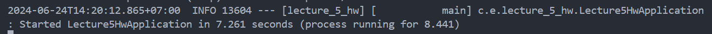

### 📸 Screenshots
Here is some result of the APIs created.
1. **Get All Employees** 
    `(GET /api/v1/employee)`

    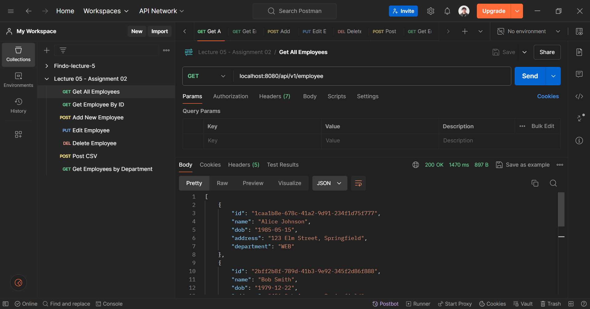
2. **Get Employee By ID**
    `(GET /api/v1/employee/3ccd3c90-890e-41c4-9fa3-456f3d97f999)`

    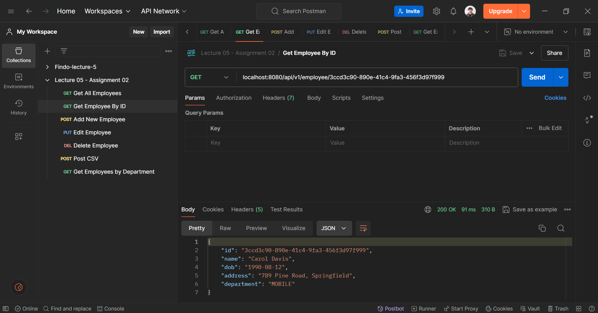
3. **Add New Employee**
    `(POST /api/v1/employee)`
    Body (Raw):
    ```json
    {
        "id": "b002747b-4cc3-4a81-bd7e-e3184da0410a",
        "name": "Michael Leon",
        "dob": "2003-12-18",
        "address": "Anytime anywhere",
        "department": "MOBILE"
    }
    ```

    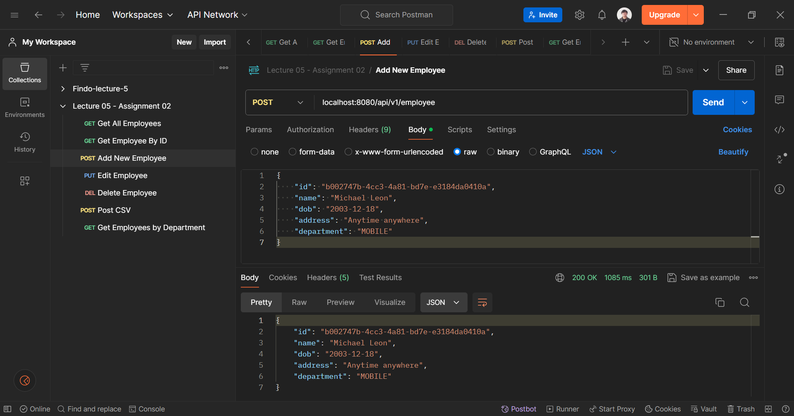
    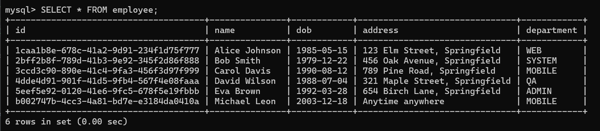
4. **Edit Employee**
    `(PUT /api/v1/employee/b002747b-4cc3-4a81-bd7e-e3184da0410a)`
    Body (Raw):
    ```json
    {
        "name": "Leon Michael",
        "dob": "2003-12-18",
        "address": "Anytime anywhere anyplace",
        "department": "MOBILE"
    }
    ```

    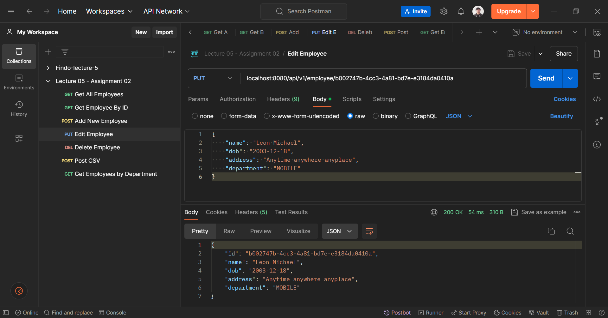
    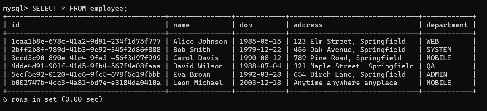
5. **Delete Employee**
    `(DELETE /api/v1/employee/b002747b-4cc3-4a81-bd7e-e3184da0410a)`

    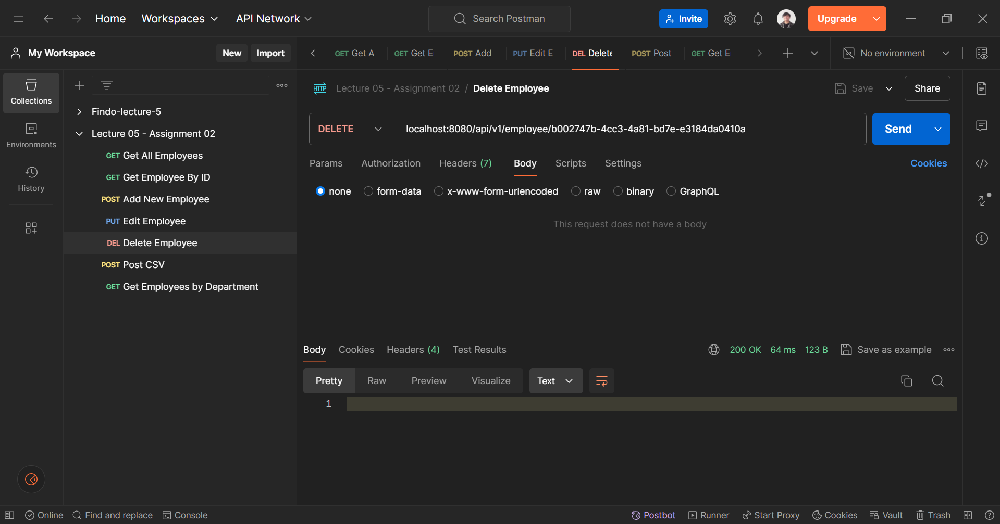
    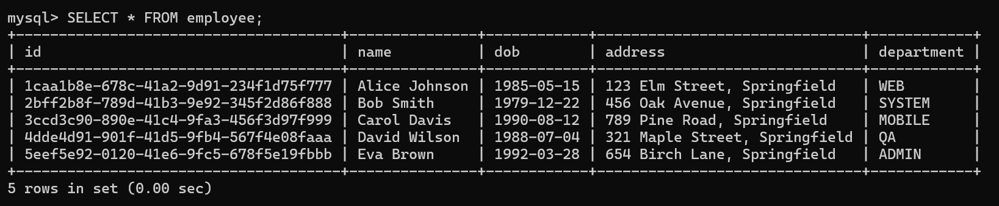
6. **Post CSV**
    `(POST /api/v1/employee/upload-csv)`

    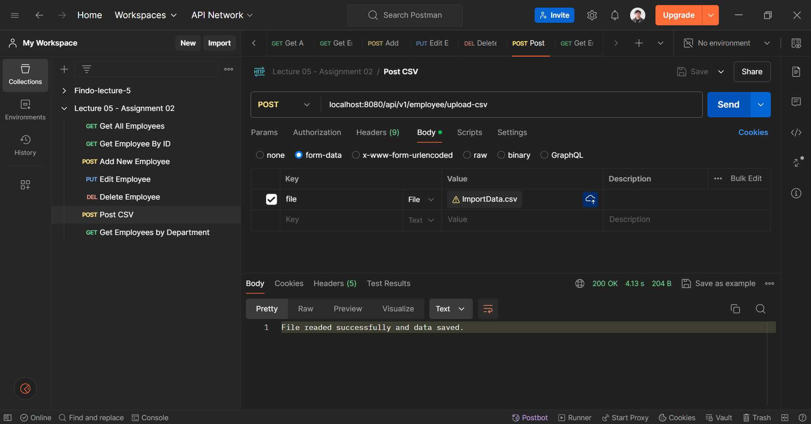
    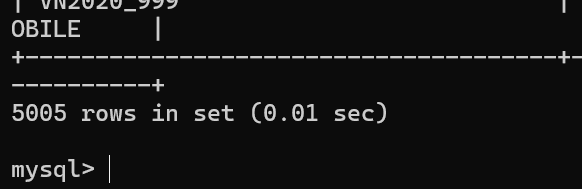
7. **Get Employees by Department**
    `(GET /api/v1/employee/by-dept?department=QA)`

    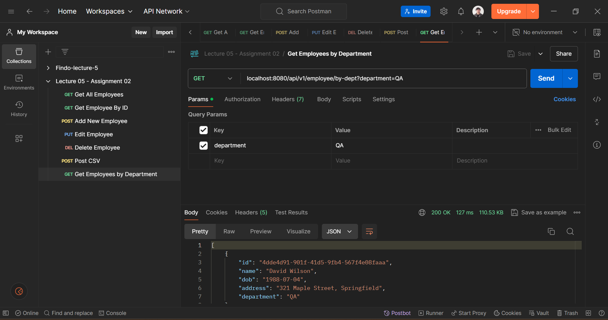

### 📬 Postman Collection
Here is the [postman collection](/Week%2003/Lecture%2005/Assignment%2002/Lecture%2005%20-%20Assignment%2002.postman_collection.json) you can use to demo the API functionality.