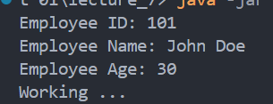

# 👩🏻‍🏫 Lecture 07 - Spring Core
> This repository is created as a part of assignment for Lecture 07 - Spring Core

## 🌱 Assignment 01 - Dependency Injection and Bean Annotations (Part 1)
### 🤔 Task 1 - Advantages and Drawbacks of Dependency Injection (DI)
#### 📌 What is Dependency Injection?
Dependency Injection is a design pattern used in software development to **achieve Inversion of Control (IoC)** between classes and their dependencies. Instead of a class creating its own dependencies (or dependent objects), DI allows those dependencies to be injected from an external source. This promotes loose coupling, improves code maintainability, and facilitates testing.

#### ❓ How Dependency Injection Works
To understand DI, let's look at a simple analogy and then dive into a practical example.

Imagine you are a coffee shop owner. Instead of the coffee shop making its own coffee beans (dependency), it gets coffee beans delivered from a supplier. If you want to change the type of beans, you just switch the supplier, without changing anything inside the coffee shop.

In programming, this means that a class (like the coffee shop) receives its dependencies (like coffee beans) from an external source rather than creating them itself.

#### ✅ Advantages of Dependency Injection
Sure! Let's delve deeper into the advantages and drawbacks of Dependency Injection (DI) with more detailed explanations and examples.

1. **Decoupling of Components**
    DI promotes loose coupling between components. Instead of a class creating its dependencies, they are provided externally. This allows components to be developed, tested, and maintained independently of one another.
    **Example**: 
    ```java
    // Without DI
    public class Car {
        private Engine engine = new Engine(); // Tightly coupled to Engine class
    }

    // With DI
    public class Car {
        private Engine engine;
        public Car(Engine engine) {
            this.engine = engine; // Engine is injected, allowing for different implementations
        }
    }
    ```
    In the DI example, `Car` can work with any implementation of `Engine`, not just a specific one.

2. **Ease of Testing**
    DI makes it easier to substitute dependencies with mock objects, facilitating unit testing.
    **Example**:
    ```java
    // Car class with DI
    public class Car {
        private Engine engine;
        public Car(Engine engine) {
            this.engine = engine;
        }
        public void start() {
            engine.run();
        }
    }

    // Mock Engine for testing
    public class MockEngine extends Engine {
        public void run() {
            // Mock behavior for testing
        }
    }

    // Test
    Car car = new Car(new MockEngine());
    car.start(); // Uses mock engine
    ```

3. **Flexibility and Configurability**
    DI allows the system to be easily reconfigured or extended by changing the external configuration, without modifying the application code.
    **Example**:
    - **XML Configuration**
        
        ```xml
        <bean id="engine" class="com.example.DieselEngine" />
        ```
    - **Java Configuration**
        
        ```java
        @Bean
        public Engine engine() {
            return new DieselEngine();
        }
        ```

4. **Improved Readability and Maintainability**
    Dependencies are clearly visible in the constructor or setter methods, making the code more readable and easier to maintain.
    **Example**:
    ```java
    public class Service {
        private Repository repository;
        public Service(Repository repository) {
            this.repository = repository; // Dependency is visible here
        }
    }
    ```
    It’s clear from the constructor that `Service` depends on `Repository`.

5. **Centralized Dependency Management**
    DI frameworks often allow centralized management of dependencies through configuration files or classes, improving control over dependency lifecycle and configuration.
    **Example**:
    ```java
    @Configuration
    public class AppConfig {
        @Bean
        public Service service() {
            return new Service(repository());
        }

        @Bean
        public Repository repository() {
            return new RepositoryImpl();
        }
    }
    ```
    All dependencies are managed in `AppConfig`, simplifying changes.

#### ❌ **Drawbacks of Dependency Injection**

1. **Steep Learning Curve**
    DI introduces new concepts and patterns that can be difficult for beginners to grasp, especially when using complex DI frameworks.
    **Example**:
    Understanding concepts like bean scopes, lifecycle callbacks, or proxying in Spring can be challenging for newcomers.

2. **Configuration Overhead**
    Extensive configuration can be required, especially in XML-based DI frameworks, leading to verbosity and potential errors.
    **Example**:
    ```xml
    <!-- XML Configuration for a simple dependency -->
    <bean id="service" class="com.example.Service">
        <property name="repository" ref="repository"/>
    </bean>
    <bean id="repository" class="com.example.RepositoryImpl"/>
    ```
    This overhead is often mitigated by using annotations, but XML can still be verbose.

3. **Performance Considerations**
    DI frameworks introduce a performance overhead due to reflection or dynamic proxies used to resolve and inject dependencies.
    **Example**:
    Creating a proxy for a class or initializing beans lazily can introduce performance hits compared to direct instantiation.

4. **Difficulty in Debugging**:
    Errors in DI configuration or dependency resolution can be hard to debug because they occur outside the normal control flow.
    **Example**:
    Misconfigured beans or missing dependencies might only become evident at runtime, and the stack trace can be less informative.

5. **Overhead for Simple Applications**:
    DI can be overkill for small applications where the benefits of loose coupling and testability are outweighed by the complexity it introduces.
    **Example**:
    For a simple command-line application or script, manually managing dependencies might be simpler and more straightforward than setting up a DI framework.

**Dependency Injection** provides significant benefits like decoupling, testability, and flexibility but comes with its own set of challenges like complexity, configuration overhead, and potential performance issues. The choice to use DI should consider the size and complexity of the project, team expertise, and specific needs for modularity and maintainability.

<br>

### 🔁 Task 2 - Create `Employee` Class and Convert XML Bean Declaration to Java Configuration
In this task, i need to:
1. Create a class `Employee`.
2. Use Java configuration to replace XML-based configuration for beans.
3. Use constructor-based injection.

#### 🐾 Step-by-Step Explanation
1. Create the `Employee` and `EmployeeWork` Classes
    - `Employee` class will have attributes like `id`, `name`, `age`, and an `EmployeeWork` instance.
    - `EmployeeWork` class will contain a method that represents work.
2. Convert XML Configuration to Java Configuration
    - Define beans using `@Configuration` and `@Bean` annotations.
    - Use constructor-based injection to inject dependencies.

#### ➡️ Configuration Conversion
**Original XML Configuration**
```xml
<beans>
    <bean id="employee" class="com.helen.demo.entity.Employee">
        <constructor-arg name="name" value="GL" />
        <constructor-arg name="employeeWork">
            <bean class="com.helen.demo.EmployeeWork" />
        </constructor-arg>
    </bean>
</beans>
```

**Equivalent Java Configuration**
```java
package com.helen.demo.config;

import com.helen.demo.entity.Employee;
import com.helen.demo.EmployeeWork;
import org.springframework.context.annotation.Bean;
import org.springframework.context.annotation.Configuration;

@Configuration
public class AppConfig {

    @Bean
    public EmployeeWork employeeWork() {
        return new EmployeeWork();
    }

    @Bean
    public Employee employee() {
        return new Employee("GL", employeeWork());
    }
}
```

But since on the slide is mentioned that the `Employee` class will have attribute `id`, `name`, and `class`, some classes need to be modified.

#### 👨‍💻 Implementation
1. [**`Employee` Class**](/Week%2004/Lecture%2007/Assignment%2001/lecture_7/src/main/java/com/example/lecture_7/entity/Employee.java)
    - **Constructor Injection**: The constructor of `Employee` takes `id`, `name`, `age`, and `EmployeeWork` as parameters. This ensures that all these dependencies are provided when the `Employee` object is created.
2. [**`EmployeeWork` Class**](/Week%2004/Lecture%2007/Assignment%2001/lecture_7/src/main/java/com/example/lecture_7/EmployeeWork.java)
    - **Simple Dependency**: This class has a single method, `work()`, which prints a message. It represents a task that an employee performs.
3. [**`AppConfig` Class**](/Week%2004/Lecture%2007/Assignment%2001/lecture_7/src/main/java/com/example/lecture_7/config/AppConfig.java)
    - **Java Configuration**: This class is annotated with `@Configuration`, indicating that it contains bean definitions.
    - **Bean Methods**:
        - **`employeeWork()`**: Defines the `EmployeeWork` bean.
        - **`employee()`**: Defines the `Employee` bean and injects the `EmployeeWork` bean using the constructor. It also sets values for `id`, `name`, and `age`.
4. [**`Lecture7Application` Class**](/Week%2004/Lecture%2007/Assignment%2001/lecture_7/src/main/java/com/example/lecture_7/Lecture7Application.java)
    - **Main Method**: Initializes the Spring context using `AnnotationConfigApplicationContext` and retrieves the `Employee` bean. It then calls `employee.working()`, demonstrating that the `Employee` bean has been correctly instantiated with its dependencies injected.

#### ⚙️ How to run the program
1. Go to the `lecture_7` directory by using this command
    ```bash
    $ cd lecture_7
    ```
2. Make sure you have maven installed on your computer, use `mvn -v` to check the version.
3. If you are using windows, you can run the program by using this command.
    ```bash
    $ ./run.bat
    ```
    And if you are using Linux, you can run the program by using this command.
    ```bash
    $ chmod +x run.sh
    $ ./run.sh
    ```

If all the instruction is well executed, the result will be something like this.



<br>

### 💉 Task 3 - Setter-Based Dependency Injection Using `@Configuration`
#### 🐾 Step-by-Step Explanation
1. Modify the `Employee` Class
    - Add setter methods for the `name` and `employeeWork` fields.
    - Ensure there is a no-argument constructor.
2. Update `AppConfig` for Setter Injection
    
    Use setters in the bean configuration methods to inject dependencies.

#### 👨‍💻 Updated Code
1. [**`Employee` Class**](/Week%2004/Lecture%2007/Assignment%2001/lecture_7/src/main/java/com/example/lecture_7/entity/Employee.java)
    - Modified to include setters (`setId`, `setName`, `setAge` and `setEmployeeWork`) for setting the `id`, `name`, `age`, and `employeeWork` dependencies.
    - A no-argument constructor is added to allow the creation of the object without immediately needing dependencies.
2. [**`AppConfig` Class**](/Week%2004/Lecture%2007/Assignment%2001/lecture_7/src/main/java/com/example/lecture_7/config/AppConfig.java)
    - Uses setter methods to inject dependencies into the `Employee` bean after its creation.
    - Instantiates the `Employee` object and then sets the `id`, `name`, `age`, and `employeeWork` properties using the respective setters.

#### ⚙️ How to run the program
You can use guide on how to run the program like the previous task, and the result must be showing the same thing


#### 🔑 Key Differences Between Constructor and Setter Injection
1. **Constructor Injection**
    - Dependencies are provided when the object is created, making it impossible to create the object without its dependencies.
    - Generally preferred for mandatory dependencies, ensuring the object is always in a valid state.
2. **Setter Injection**
    - Dependencies can be provided after the object is created, allowing the object to be created in an incomplete state.
    - Useful for optional dependencies or when dependencies are not known at creation time.