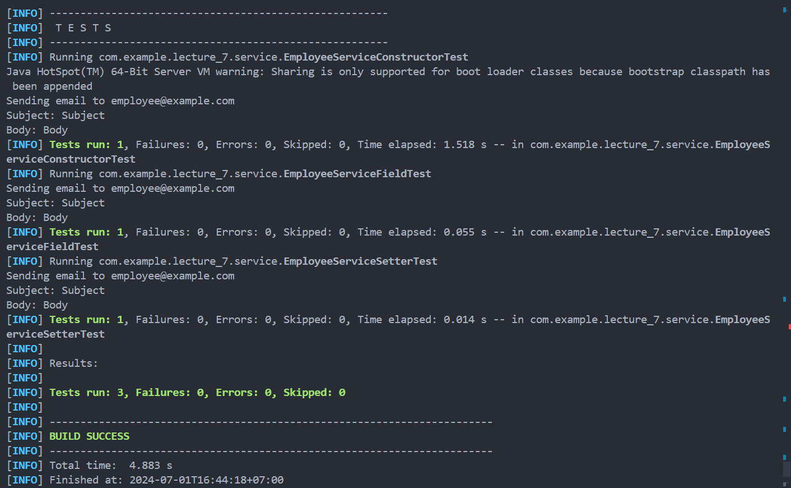

# 👩🏻‍🏫 Lecture 07 - Spring Core
> This repository is created as a part of assignment for Lecture 07 - Spring Core

## 🌱 Assignment 02 - Dependency Injection and Bean Annotations (Part 2)
### ✍️ Task 1 - Working with Annotations
**Objective**: Create `EmailService` interface and `EmailServiceImpl` class. Add a method for sending email. Create `EmployeeService` class and use `EmailService` with Dependency Injection (DI) to send emails to employees about their work. Demonstrate DI using constructor, field, and setter injection.

#### 💬 Dependency Injection Methods
1. **Constructor Injection**: This method injects dependencies through the class constructor. It’s often preferred for its simplicity and for making dependencies explicit and immutable.
2. **Field Injection**: This method injects dependencies directly into the fields of the class. It’s less preferred because it hides dependencies and makes testing harder.
3. **Setter Injection**: This method injects dependencies through setter methods. It’s useful for optional dependencies or where dependencies can change during the object's lifecycle.

#### 👨‍💻 Implementation
1. [**`EmailService` Interface**](/Week%2004/Lecture%2007/Assignment%2002/lecture_7/src/main/java/com/example/lecture_7/service/EmailService.java)
    - **Purpose**: Define a contract for email sending functionality.
    - **Methods**: Should at least include `sendEmail`.
2. [**`EmailServiceImpl` Class**](/Week%2004/Lecture%2007/Assignment%2002/lecture_7/src/main/java/com/example/lecture_7/service/EmailServiceImpl.java)
    - **Purpose**: Implement the `EmailService` to provide actual email sending logic.
    - **Annotations**: Use `@Service` to denote it as a Spring-managed service component.
3. [**`EmployeeServiceConstructor` Class**](/Week%2004/Lecture%2007/Assignment%2002/lecture_7/src/main/java/com/example/lecture_7/service/EmployeeServiceConstructor.java)

    The `EmailService` is injected via the constructor. This ensures that `EmployeeServiceConstructor` is properly instantiated with a valid `EmailService`.
    - **Purpose**: Use `EmailService` to send notifications to employees.
    - **Tasks**: Demonstrate DI through constructor injection.
    - **Preferred**: Dependencies are immutable, making the class easier to test and understand.
4. [**`EmployeeServiceField` Class**](/Week%2004/Lecture%2007/Assignment%2002/lecture_7/src/main/java/com/example/lecture_7/service/EmployeeServiceField.java)
    
    The `@Autowired` annotation directly injects the `EmailService` into the field. This can make it less clear what dependencies the class needs.
    - **Purpose**: Use `EmailService` to send notifications to employees.
    - **Tasks**: Demonstrate DI through field injection.
    - **Direct Injection**: Dependencies are directly injected into fields.
    - **Less Preferred**: Less explicit, and harder to test as it requires Spring’s context to be loaded.
5. [**`EmployeeServiceSetter` Class**](/Week%2004/Lecture%2007/Assignment%2002/lecture_7/src/main/java/com/example/lecture_7/service/EmployeeServiceSetter.java)
    
    The `EmailService` is injected through a setter method. This allows flexibility in changing the `EmailService` dependency if needed.
    - **Purpose**: Use `EmailService` to send notifications to employees.
    - **Tasks**: Demonstrate DI through field injection.
    - **Configurable**: Dependencies can be set or changed after object creation.
    - **Use Case**: When dependencies are optional or can be changed.
6. [**`AppConfig` Class**](/Week%2004/Lecture%2007/Assignment%2002/lecture_7/src/main/java/com/example/lecture_7/config/AppConfig.java)
    - **`@Configuration`**: This annotation is used to indicate that the class declares one or more `@Bean` methods and may be processed by the Spring container to generate bean definitions and service requests for those beans at runtime.
    - **`@ComponentScan(basePackages = "com.example.lecture_7")`**: This annotation is used to specify the base packages to scan for Spring components. In this case, it tells Spring to scan the `com.example.lecture_7` package and its sub-packages for Spring components such as `@Component`, `@Service`, `@Repository`, and `@Controller`. Spring will then automatically register these components as beans in the application context.
    - **Purpose**: `AppConfig` serves as a configuration class for the Spring application. It typically includes configuration of beans using `@Bean` methods, setup of Spring-specific configurations, and enabling component scanning to discover Spring components automatically.
7. [**`Lecture7Application` Class**](/Week%2004/Lecture%2007/Assignment%2002/lecture_7/src/main/java/com/example/lecture_7/Lecture7Application.java)
    Serves as the main application for the Java Spring Boot.

#### 👀 Testing
To test the `EmployeeService` classes and their interaction with `EmailService` in a Spring Boot application, we can place your test code in the `src/test/java` directory. This is the standard convention for Java testing in Spring Boot projects.

The test is defined in [**`EmployeeServiceConstructorTest`**](/Week%2004/Lecture%2007/Assignment%2002/lecture_7/src/test/java/com/example/lecture_7/service/EmployeeServiceConstructorTest.java), [**`EmployeeServiceFieldTest`**](/Week%2004/Lecture%2007/Assignment%2002/lecture_7/src/test/java/com/example/lecture_7/service/EmployeeServiceFieldTest.java), and [**`EmployeeServiceSetterTest`**](/Week%2004/Lecture%2007/Assignment%2002/lecture_7/src/test/java/com/example/lecture_7/service/EmployeeServiceSetterTest.java) classes.

Here is how to run all the tests
1. Go to the `lecture_7` directory by using this command
    ```bash
    $ cd lecture_7
    ```
2. Make sure you have maven installed on your computer, use `mvn -v` to check the version.
3. Run this code to do the test
    ```bash
    $ mvn test
    ```

If all the instruction is well executed, the test result will be something like this.



From the result, we know that all the test **executed successfully** and all of them **give the same output**.

---

### 🔎 Task 2 - Comparison of Dependency Injection Types

#### 1️⃣ Constructor Injection
Constructor injection involves injecting dependencies through the class constructor. This is one of the most common and recommended approaches because it ensures that the class is initialized with all required dependencies right from the start.

**Pros**: Dependencies are immutable and explicit.
**Cons**: Can be verbose with many dependencies.

#### 2️⃣ Field Injection
Field injection involves injecting dependencies directly into class fields. This approach is simpler to implement but has some drawbacks, such as making dependencies less clear and hindering testability, especially with mocking frameworks.

**Pros**: Simpler and cleaner in terms of code.
**Cons**: Hides dependencies, making the code less clear and harder to test.

#### 3️⃣ Setter Injection
Setter injection involves injecting dependencies through setter methods. This approach allows dependencies to be set or changed after the object is constructed. It provides flexibility but can lead to partially initialized objects and is less suitable for required dependencies.

**Pros**: Allows for optional dependencies and changing dependencies.
**Cons**: Dependencies are mutable, and it's less obvious which dependencies are required.

#### 📌 Summary
**Constructor Injection**: Best practice, ensures dependencies are provided at object creation, promotes clear and testable code.
**Field Injection**: Simpler but leads to tighter coupling, harder to test in isolation.
**Setter Injection**: Flexible but can lead to mutable objects and harder to reason about dependencies.

---

### 🔴 Task 3 - Circular Dependency Injection
Circular Dependency Injection (CDI) occurs when two or more classes have dependencies on each other directly or indirectly, forming a cycle. This situation can create challenges for dependency injection frameworks because they rely on constructors or setters to inject dependencies, and a circular dependency prevents the straightforward creation of objects.

#### 💡 Understanding Circular Dependency

Consider two classes, `ClassA` and `ClassB`, where:

- `ClassA` depends on `ClassB`.
- `ClassB` depends on `ClassA`.

```java
public class ClassA {
    private ClassB b;

    public ClassA(ClassB b) {
        this.b = b;
    }
    // Methods using b
}

public class ClassB {
    private ClassA a;

    public ClassB(ClassA a) {
        this.a = a;
    }
    // Methods using a
}
```

In this scenario:
- `ClassA` requires an instance of `ClassB`.
- `ClassB` requires an instance of `ClassA`.
- This forms a circular dependency because `ClassA` depends on `ClassB` and vice versa.

#### 🤯 Challenges with Circular Dependency

Dependency Injection frameworks typically construct objects using constructors or setters. However, with circular dependencies.
- **Constructor Injection:** Cannot be resolved because each class requires an instance of the other, causing a deadlock during object creation.
- **Setter Injection:** Faces similar issues if setters are used to inject dependencies after object creation.

#### 🧩 Resolving Circular Dependency

To resolve circular dependencies, dependency injection frameworks like Spring provide several solutions:

1. **Constructor-Based Injection with `@Autowired`**
   ```java
   public class ClassA {
       private ClassB b;

       @Autowired
       public ClassA(ClassB b) {
           this.b = b;
       }
       // Methods using b
   }

   public class ClassB {
       private ClassA a;

       @Autowired
       public ClassB(ClassA a) {
           this.a = a;
       }
       // Methods using a
   }
   ```

   Use `@Autowired` on constructors to allow the framework to manage the creation order of beans.

2. **Setter-Based Injection**
   ```java
   public class ClassA {
       private ClassB b;

       @Autowired
       public void setB(ClassB b) {
           this.b = b;
       }
       // Methods using b
   }

   public class ClassB {
       private ClassA a;

       @Autowired
       public void setA(ClassA a) {
           this.a = a;
       }
       // Methods using a
   }
   ```

   Use setter methods annotated with `@Autowired` to inject dependencies after objects are created.

3. **Interface-Based Proxying:**
   Dependency injection frameworks may use proxies or lazy initialization to break the circular dependency.
    ```java
    @Autowired
    @Lazy
    private B b;
    ```
    Use `@Lazy` annotation to create a proxy for one of the beans.

4. **Refactoring:**
   Sometimes, refactoring the design to eliminate the circular dependency by introducing an intermediary interface or by rethinking class responsibilities can resolve the issue.

#### 🤔 Best Practices

- **Prefer Constructor Injection:** Whenever possible, use constructor injection as it ensures dependencies are resolved at object creation time.
- **Avoid Circular Dependencies:** Design classes to minimize or eliminate circular dependencies, as they complicate testing and maintenance.
- **Use Dependency Injection Framework Features:** Leverage features provided by dependency injection frameworks to manage circular dependencies, such as lazy initialization or proxies.

---

### 💯 Task 4 - Some Annotations Explanation and Examples
#### `@Configuration`
**Purpose**: Marks a class as a source of bean definitions for the application context.

**Example**:
```java
import org.springframework.context.annotation.Bean;
import org.springframework.context.annotation.Configuration;

@Configuration
public class AppConfig {
    @Bean
    public EmailService emailService() {
        return new EmailServiceImpl();
    }
}
```

#### `@Bean`
**Purpose**: Indicates that a method produces a bean to be managed by the Spring container.

**Example**:
```java
@Bean
public EmailService emailService() {
    return new EmailServiceImpl();
}
```

#### `@ComponentScan`
**Purpose**: Configures component scanning directives for use with `@Configuration` classes.

**Example**:
```java
import org.springframework.context.annotation.ComponentScan;
import org.springframework.context.annotation.Configuration;

@Configuration
@ComponentScan(basePackages = "com.example")
public class AppConfig {
}
```

#### `@Component`
**Purpose**: Indicates that a class is a Spring component.

**Example**:
```java
import org.springframework.stereotype.Component;

@Component
public class EmailServiceImpl implements EmailService {
    // Implementation
}
```

#### `@Service`
**Purpose**: Indicates that a class is a service component in the business layer.

**Example**:
```java
import org.springframework.stereotype.Service;

@Service
public class EmployeeService {
    // Implementation
}
```

#### `@Repository`
**Purpose**: Indicates that a class is a data repository and provides an abstraction of data access.

**Example**:
```java
import org.springframework.stereotype.Repository;

@Repository
public class EmployeeRepository {
    // Implementation
}
```

#### `@Autowired`
**Purpose**: Enables automatic injection of dependencies.

**Example**:
```java
@Autowired
private EmailService emailService;
```

#### `@Scope`
**Purpose**: Specifies the scope of a bean (singleton, prototype, etc.).

**Example**:
```java
import org.springframework.context.annotation.Scope;
import org.springframework.stereotype.Component;

@Component
@Scope("prototype")
public class EmailServiceImpl implements EmailService {
    // Implementation
}
```

#### `@Qualifier`
**Purpose**: Disambiguates injection when multiple beans of the same type exist.

**Example**:
```java
@Autowired
@Qualifier("emailServiceImpl")
private EmailService emailService;
```

#### `@PropertySource` and `@Value`
**Purpose**: Allows for externalizing property values into a properties file.

**Example**:
```java
import org.springframework.beans.factory.annotation.Value;
import org.springframework.context.annotation.Configuration;
import org.springframework.context.annotation.PropertySource;

@Configuration
@PropertySource("classpath:application.properties")
public class AppConfig {
    @Value("${email.service.url}")
    private String emailServiceUrl;
}
```

#### `@PreDestroy` and `@PostConstruct`
**Purpose**: Used for lifecycle callback methods to release resources before bean destruction or perform initialization after bean creation.

**Example**:
```java
import javax.annotation.PostConstruct;
import javax.annotation.PreDestroy;

@Component
public class EmailServiceImpl implements EmailService {
    @PostConstruct
    public void init() {
        // Initialization code
    }

    @PreDestroy
    public void cleanup() {
        // Cleanup code
    }
}
```