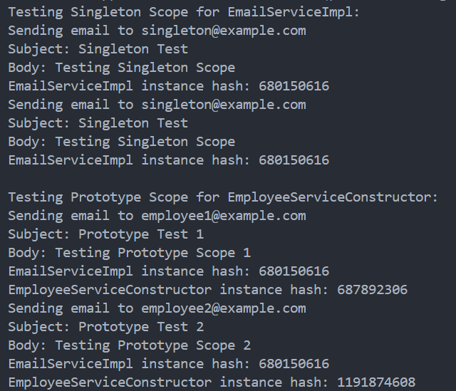
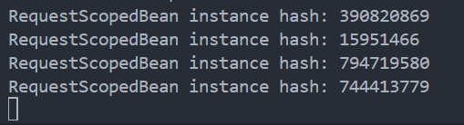

# 👩🏻‍🏫 Lecture 07 - Spring Core
> This repository is created as a part of assignment for Lecture 07 - Spring Core

## 🌱 Assignment 03 - Dependency Injection and Bean Annotations (Part 3)
### 🎯 Task 1 - Add Bean Scopes (Singleton, Prototype) to Assignment 2
**Bean scopes** in Spring determine the lifecycle and visibility of beans within the Spring container. Here, we’ll focus on:
- **Singleton Scope**: A single instance of the bean is created and shared across the entire application.
- **Prototype Scope**: A new instance of the bean is created each time it is requested.

#### 👨‍💻 Implementation
1. [**`EmailServiceImpl` Interface**](/Week%2004/Lecture%2007/Assignment%2003/lecture_7/src/main/java/com/example/lecture_7/service/EmailServiceImpl.java)

    `EmailServiceImpl` is already a singleton by default, but we'll explicitly annotate it for clarity and print its hash code when the `sendEmail` method is called.

2. [**`EmployeeServiceConstructor` Class**](/Week%2004/Lecture%2007/Assignment%2003/lecture_7/src/main/java/com/example/lecture_7/service/EmployeeServiceConstructor.java)

    We'll modify the `EmployeeServiceConstructor` class to demonstrate the prototype scope.
    - The `@Scope("prototype")` annotation makes each request for `EmployeeServiceConstructor` create a new instance.
    - The `notifyEmployee` method will print the hash code of the current `EmployeeServiceConstructor` instance, demonstrating that different instances are created for each call.

3. [**`Lecture7Application` Class**](/Week%2004/Lecture%2007/Assignment%2003/lecture_7/src/main/java/com/example/lecture_7/Lecture7Application.java)

    We’ll print the hash codes to demonstrate that `EmailService` behaves as singleton and `EmployeeServiceConstructor` behaves as a prototype.

#### ⚙️ How to run the program
1. Go to the `lecture_7` directory by using this command
    ```bash
    $ cd lecture_7
    ```
2. Make sure you have maven installed on your computer, use `mvn -v` to check the version.
3. If you are using windows, you can run the program by using this command.
    ```bash
    $ ./run.bat
    ```
    And if you are using Linux, you can run the program by using this command.
    ```bash
    $ chmod +x run.sh
    $ ./run.sh
    ```

If all the instruction is well executed, the result will be something like this.



#### 📝 Summary
1. **Singleton Scope**: Demonstrated by `EmailServiceImpl`, which is a singleton by default. The same instance is used across the application.
2. **Prototype Scope**: Demonstrated by `EmployeeServiceConstructor`, which creates a new instance each time it is requested.

This clear differentiation shows how different scopes manage bean instances, and printing hash codes helps in verifying the behavior.

---

### 🕹️ Task 2 - Create a Controller and Test Request Scope
We will create a simple Spring MVC controller that uses a **request-scoped** bean. We'll demonstrate how this scope works in the context of HTTP requests by printing out information about the bean instance for each request. This will illustrate that a new bean instance is created for each HTTP request.

#### 🤔 **Understanding Request Scope**
**Request Scope**: In the Spring context, a bean defined with the request scope will have a new instance created for each HTTP request. This is commonly used in web applications to handle user-specific data during the request processing.

#### 🐾 **Implementation Steps**

1. **Create a Request-Scoped Bean**: Define a bean that has the request scope.
2. **Create a Controller**: Use this bean in a Spring MVC controller to demonstrate its behavior.
3. **Test the Request Scope**: Use a simple client or browser to make HTTP requests and observe the bean's behavior.

#### 👨‍💻 **Implementation**

1. **`RequestScopedBean.java`**(Request-Scoped Bean)

    We’ll define a bean that will be instantiated for each HTTP request. We’ll print its hash code to verify that a new instance is created for each request.
    
    The code is implemented on [this file](/lecture_7_1/src/main/java/com/example/lecture_7_1/controller/RequestController.java)

    Here is the explanation on what the code actually done.
    - The `@Scope(value = WebApplicationContext.SCOPE_REQUEST, proxyMode = ScopedProxyMode.TARGET_CLASS)` annotation inject a proxy into your controller instead of the actual bean, allowing proper request scope resolution.
    - The `handleRequest` method prints the hash code of the instance, helping us verify that a new instance is created for each request.

2. **`RequestController.java`** (Controller)

    Create a controller that will use the `RequestScopedBean` to handle HTTP requests.

    The code is implemented on [this file](/lecture_7_1/src/main/java/com/example/lecture_7_1/service/RequestScopedBean.java)

    Here is the explanation on what the code actually done.
    - The `@RestController` annotation makes this class a REST controller that can handle HTTP requests.
    - The `@GetMapping("/testRequest")` annotation maps HTTP GET requests to the `testRequestScope` method.
    - This method calls `handleRequest` on `RequestScopedBean` and returns a message, while the `RequestScopedBean` prints its hash code to the console.
    - `ObjectFactory` from Spring’s `BeanFactory` is used to lazily resolve the request-scoped bean.

3. **`Lecture71Application.java`** (Main Application)

    This class is used as the main program. In this case we need to ensure your application is configured to scan for the `controller` and `service` packages.

    The code is implemented on [this file](/lecture_7_1/src/main/java/com/example/lecture_7_1/Lecture71Application.java)

    Here is the explanation on what the code actually done.
    - Ensure `@SpringBootApplication` is used to automatically configure and scan components.
    - The application will now handle HTTP requests to `/testRequest`.

#### ⚙️ **Testing Request Scope**

1. **Run the Application**: Start the Spring Boot application.
    1. Go to the `lecture_7_1` directory by using this command
        ```bash
        $ cd lecture_7_1
        ```
    2. Make sure you have maven installed on your computer, use `mvn -v` to check the version.
    3. If you are using windows, you can run the program by using this command.
        ```bash
        $ ./run.bat
        ```
        And if you are using Linux, you can run the program by using this command.
        ```bash
        $ chmod +x run.sh
        $ ./run.sh
        ```

2. **Access the Endpoint**: Use a browser or a tool like `curl` or Postman to access `http://localhost:8080/testRequest`. In this section i use the curl one with commdn like this
    ```bash
    $ curl http://localhost:8080/testRequest
    ```

If you are doing well, the result will be something like this.



Each request to `/testRequest` creates a new instance of `RequestScopedBean`, verified by different hash codes.

#### 📝 **Summary**

1. **Created `RequestScopedBean`**:
   - Defined with request scope, so a new instance is created for each HTTP request.
   - Prints its hash code to the console to verify instance creation.

2. **Created `RequestController`**:
   - Handles HTTP requests and uses `RequestScopedBean` to demonstrate the request scope.
   - Maps to the `/testRequest` endpoint.

3. **Tested the Request Scope**:
   - Verified new instances for each HTTP request using hash codes.

This setup effectively demonstrates the request scope in a Spring application, where each HTTP request receives a new bean instance, useful for handling request-specific data or operations.

---

