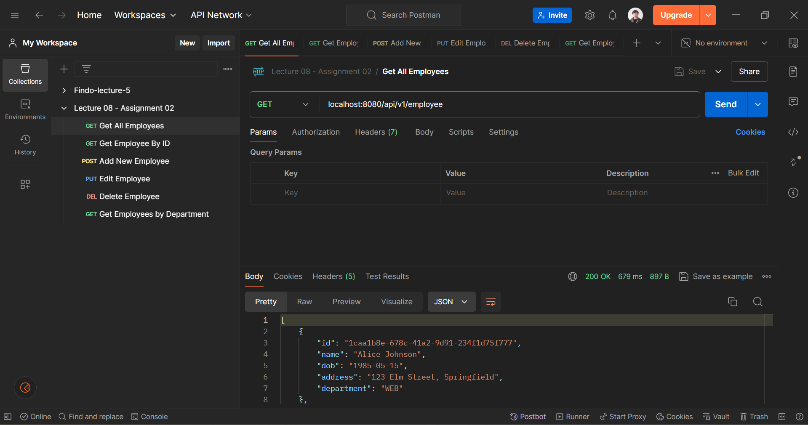
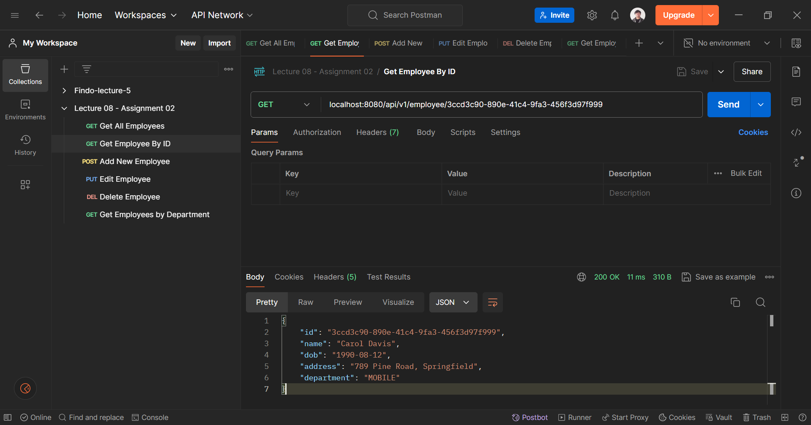
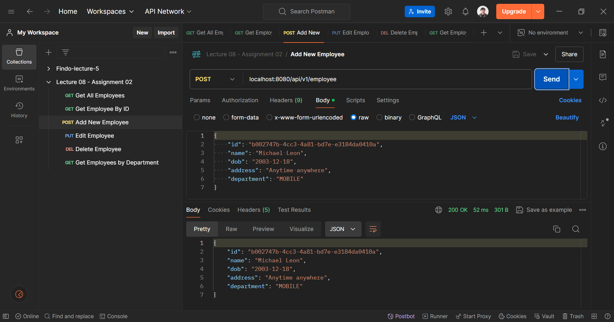
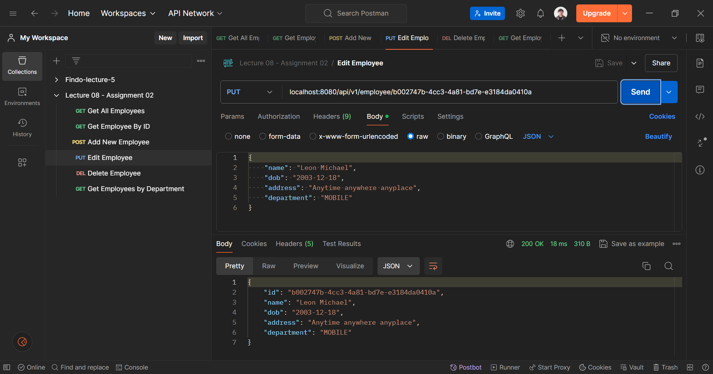
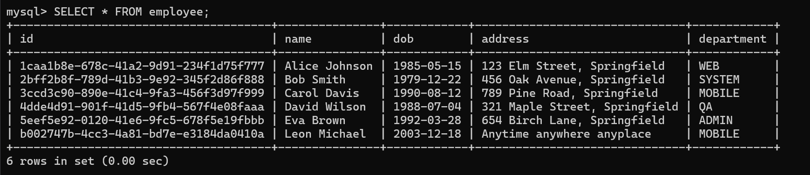
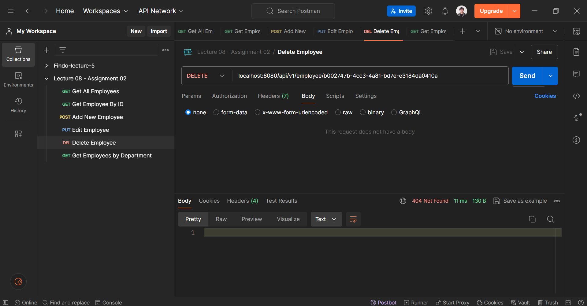
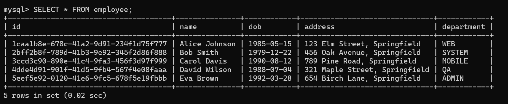
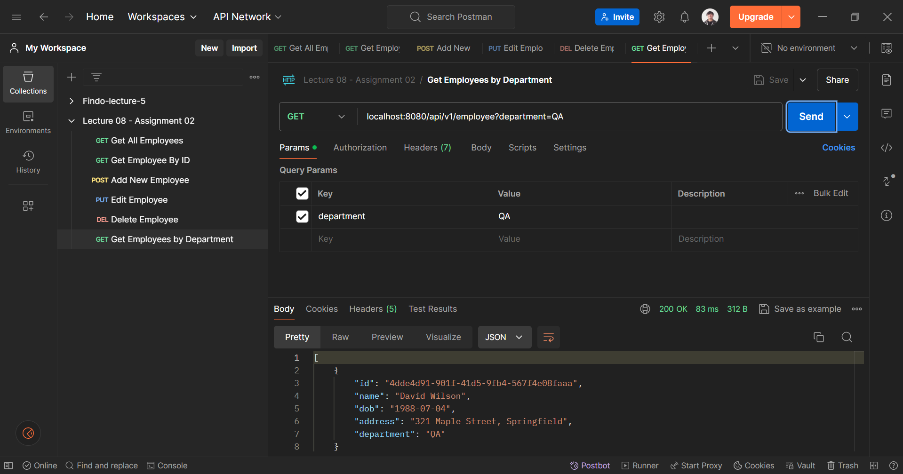

# 👩🏻‍🏫 Lecture 08 - Spring Boot
> This repository is created as a part of assignment for Lecture 08 - Spring Boot

## ✍ Assignment 02 - CRUD Project for Employee Management with JDBC Template
### 🛠️ 1. Set Up Spring Boot Project

Follow the steps to create a new Spring Boot project as i explained in the previous assignment. Ensure that we add `Spring Web`, `Spring Data JPA`, `Spring Boot DevTools`, and `MySQL Driver` as dependencies.

### 🗄️ 2. Create Employee Table in MySQL

Execute the following SQL script to create the database and the `employee` table in MySQL:

```sql
-- Create the database
CREATE DATABASE week4_lecture8;

-- Use the database
USE week4_lecture8;

-- Create the employee table
CREATE TABLE employee (
    id VARCHAR(50) NOT NULL,
    name VARCHAR(100) COLLATE utf8mb4_unicode_ci NOT NULL,
    dob DATE NOT NULL,
    address VARCHAR(255) NOT NULL,
    department VARCHAR(100) NOT NULL,
    PRIMARY KEY (id)
);

-- Insert dummy data into the employee table
INSERT INTO employee (id, name, dob, address, department) VALUES
('1caa1b8e-678c-41a2-9d91-234f1d75f777', 'Alice Johnson', '1985-05-15', '123 Elm Street, Springfield', 'WEB'),
('2bff2b8f-789d-41b3-9e92-345f2d86f888', 'Bob Smith', '1979-12-22', '456 Oak Avenue, Springfield', 'SYSTEM'),
('3ccd3c90-890e-41c4-9fa3-456f3d97f999', 'Carol Davis', '1990-08-12', '789 Pine Road, Springfield', 'MOBILE'),
('4dde4d91-901f-41d5-9fb4-567f4e08faaa', 'David Wilson', '1988-07-04', '321 Maple Street, Springfield', 'QA'),
('5eef5e92-0120-41e6-9fc5-678f5e19fbbb', 'Eva Brown', '1992-03-28', '654 Birch Lane, Springfield', 'ADMIN');
```

### ⚙️ 3. Configure Data Source in `application.properties`

Edit the [`src/main/resources/application.properties`](/Week%2004/Lecture%2008/Assignment%2002/lecture_8_2/src/main/resources/application.properties) file to include the MySQL data source configuration.

```properties
spring.application.name=lecture_8_2

spring.datasource.url=jdbc:mysql://localhost:3308/week4_lecture8?allowPublicKeyRetrieval=true&useSSL=false
spring.datasource.username=root
spring.datasource.password=Michaeleon16606_
spring.datasource.driver-class-name=com.mysql.jdbc.Driver

spring.jpa.hibernate.ddl-auto=update
spring.jpa.show-sql=true
```

Here is the detail explanation.
- `spring.datasource.url` specifies the JDBC URL for MySQL database.
- `spring.datasource.username` and `spring.datasource.password` set the database credentials.
- `spring.datasource.driver-class-name` defines the JDBC driver class.
- `spring.jpa.hibernate.ddl-auto` specifies the DDL mode (`update` to create/update schema automatically).
- `spring.jpa.show-sql` enables logging of SQL statements.

### 📋 4. Create Employee Model

Create a new Java class `Employee` in [`src/main/java/com/example/lecture_8_2/model/Employee.java`](/Week%2004/Lecture%2008/Assignment%2002/lecture_8_2/src/main/java/com/example/lecture_8_2/model/Employee.java)

```java
package com.example.lecture_8_2.model;

import java.io.Serializable;
import java.time.LocalDate;

import jakarta.persistence.Entity;
import jakarta.persistence.Id;
import lombok.Getter;
import lombok.NoArgsConstructor;
import lombok.Setter;

@Getter
@Setter
@Entity
@NoArgsConstructor
public class Employee implements Serializable {

    private static final long serialVersionUID = 1L;

    @Id
    private String id;
    private String name;
    private LocalDate dob;
    private String address;
    private String department;

    public Employee(String id, String name, LocalDate dob, String address, String department) {
        this.id = id;
        this.name = name;
        this.dob = dob;
        this.address = address;
        this.department = department;
    }
}
```

### 📦 5. Create Employee Repository

Create a new Java class `EmployeeRepository` in [`src/main/java/com/example/lecture_8_2/repository/EmployeeRepository.java`](/Week%2004/Lecture%2008/Assignment%2002/lecture_8_2/src/main/java/com/example/lecture_8_2/repository/EmployeeRepository.java).

Here is the explanation of each method on that class.

1. **RowMapper Definition (`EMPLOYEE_ROW_MAPPER`):**

    Maps a row from the ResultSet to an Employee object.

2. **Find All Employees (`findAll`):**

    Retrieves all employees from the `employee` table.

3. **Find Employee by ID (`findById`):**

    - Retrieves an `employee` based on the provided ID.
    - Uses `Optional` to handle the possibility of no result found.

4. **Save New Employee (`save`):**

    Inserts a new employee into the employee table.

5. **Update Existing Employee (`update`):**

    Updates an existing employee's details based on their ID.

6. **Delete Employee by ID (`deleteById`):**

    Deletes an employee from the employee table based on their ID.

7. **Find Employees by Department (`findByDepartmentId`):**

    Retrieves employees that belong to a specific department.

### 🕹️ 6. Create Employee Controller

Create a new Java class `EmployeeController` in [`src/main/java/com/example/lecture_8_2/controller/EmployeeController.java`](/Week%2004/Lecture%2008/Assignment%2002/lecture_8_2/src/main/java/com/example/lecture_8_2/controller/EmployeeController.java).

**Explanation:**
- `@RestController` annotation marks this class as a controller for handling HTTP requests.
- `@RequestMapping("/api/v1/employee")` sets the base URL for all methods in this controller.
- HTTP methods `GET`, `POST`, `PUT`, and `DELETE` are used to handle respective CRUD operations.

### 🛢️ 7. Create SQL Script for Table and Data

You can also create an SQL file `schema.sql` in [`src/main/resources`](/Week%2004/Lecture%2008/Assignment%2002/lecture_8_2/src/main/resources/schema.sql) to create the table automatically on startup if using Spring Boot’s `DataSource` initialization feature:

This script runs automatically if `spring.datasource.initialize=true` (which is the default).

### 🕵 8. Testing the CRUD Application
#### 🌳 Project Structure
```bash
lecture_8_2
├── .mvn/wrapper/
│   └── maven-wrapper.properties
├── src/main/
│   ├── java/com/example/lecture_8_2/
│   │   ├── controller/
│   │   │   └── EmployeeController.java
│   │   ├── model/
│   │   │   └── Employee.java
│   │   ├── repository/
│   │   │   └── EmployeeRepository.java
│   │   └── Lecture82Application.java
│   └── resources/
│       ├── schema.sql
│       └── application.properties
├── .gitignore
├── mvnw
├── mvnw.cmd
└── pom.xml
```

#### ⚙️ **Run the Spring Boot Application Locally**

In this case i'm using maven to run my project. Here is how i do that.

1. **Open Terminal:** 
    
    Navigate to the root directory of the project where the `pom.xml` file is located.

2. **Run the Application:**
    
    Execute the following command:
    ```bash
    $ ./mvnw spring-boot:run
    ```

3. **Access the Application:** 

    Once the application starts, we can access it typically at [http://localhost:8080](http://localhost:8080).

#### 🚀 **Verify the Application**
Here is some result of the APIs created.
1. **Get All Employees** 
    `(GET /api/v1/employee)`

    
2. **Get Employee By ID**
    `(GET /api/v1/employee/3ccd3c90-890e-41c4-9fa3-456f3d97f999)`

    
3. **Add New Employee**
    `(POST /api/v1/employee)`
    
    Body (Raw):
    ```json
    {
        "id": "b002747b-4cc3-4a81-bd7e-e3184da0410a",
        "name": "Michael Leon",
        "dob": "2003-12-18",
        "address": "Anytime anywhere",
        "department": "MOBILE"
    }
    ```

    
    
4. **Edit Employee**
    `(PUT /api/v1/employee/b002747b-4cc3-4a81-bd7e-e3184da0410a)`
    
    Body (Raw):
    ```json
    {
        "name": "Leon Michael",
        "dob": "2003-12-18",
        "address": "Anytime anywhere anyplace",
        "department": "MOBILE"
    }
    ```

    
    
5. **Delete Employee**
    `(DELETE /api/v1/employee/b002747b-4cc3-4a81-bd7e-e3184da0410a)`

    
    
6. **Get Employees by Department**
    `(GET /api/v1/employee?department=QA)`

    

#### 📬 Postman Collection
Here is the [postman collection](/Week%2004/Lecture%2008/Assignment%2002/Lecture%2008%20-%20Assignment%2002.postman_collection.json) you can use to demo the API functionality.