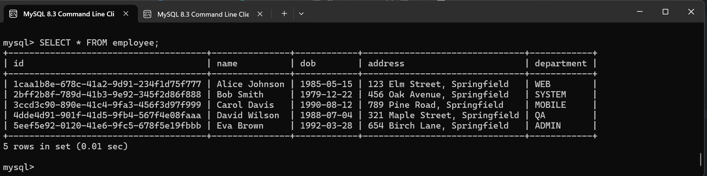

# 👩🏻‍🏫 Lecture 08 - Spring Boot
> This repository is created as a part of assignment for Lecture 08 - Spring Boot

## 💾 Assignment 03 - Multiple Datasources and Transactions
### 🔄 1. Change DataSource to Use Bean Configuration

#### 📣 **Update `application.properties` to use Multiple DataSource Configuration**

We need to add properties for each data source in the `application.properties`.

```properties
spring.application.name=lecture_8_2

# DataSource 1
spring.datasource1.jdbc-url=jdbc:mysql://localhost:3308/week4_lecture8?allowPublicKeyRetrieval=true&useSSL=false
spring.datasource1.username=root
spring.datasource1.password=Michaeleon16606_
spring.datasource1.driver-class-name=com.mysql.jdbc.Driver

# DataSource 2
spring.datasource2.jdbc-url=jdbc:mysql://localhost:3308/week4_lecture8_clone?allowPublicKeyRetrieval=true&useSSL=false
spring.datasource2.username=root
spring.datasource2.password=Michaeleon16606_
spring.datasource2.driver-class-name=com.mysql.cj.jdbc.Driver

spring.jpa.hibernate.ddl-auto=update
spring.jpa.show-sql=true
```

#### 🔧 **Create DataSource Configuration Class**

Create a new Java configuration class to define the `DataSource` bean. Define each `DataSource` as a separate bean in a configuration class. It is defined on [this file](/Week%2004/Lecture%2008/Assignment%2003/lecture_8_2/src/main/java/com/example/lecture_8_2/config/DataSourceConfig.java)

#### 🤝 **Dependencies**

Make sure to have the following dependencies in the `pom.xml`:

```xml
<dependency>
    <groupId>org.springframework.boot</groupId>
    <artifactId>spring-boot-starter-data-jdbc</artifactId>
    <exclusions>
        <exclusion>
            <groupId>org.springframework.boot</groupId>
            <artifactId>spring-boot-starter-data-jpa</artifactId>
        </exclusion>
    </exclusions>
</dependency>
<dependency>
    <groupId>org.springframework.data</groupId>
    <artifactId>spring-data-commons</artifactId>
    <version>3.2.0</version>
</dependency>
```

---

### 🧾 2. Handle Transactions for Insert/Update

#### 🤔 What is a Transaction?

In database terms, a **transaction** is a sequence of operations performed as a single logical unit of work. The key properties of a transaction are encapsulated in the ACID acronym:

- **Atomicity**: Ensures that all operations within a transaction are completed; if not, the transaction is aborted, and no changes are applied.
- **Consistency**: Ensures that the database moves from one consistent state to another consistent state.
- **Isolation**: Ensures that transactions are executed in isolation from one another.
- **Durability**: Ensures that once a transaction has been committed, it will remain so, even in the event of a system failure.

#### 🔢 Transaction in the Context of Multiple Data Sources

When working with multiple data sources, transactions become more complex because we need to ensure consistency across different databases. This is typically known as a **distributed transaction**. Here’s how it applies:

1. **Distributed Transactions**: If we need to update the same `Employee` entity in two different databases and want to ensure that either both updates succeed or both fail, we need a distributed transaction.

2. **ACID in Distributed Transactions**:
   - **Atomicity**: Both databases should either commit the transaction or roll back in case of any failure.
   - **Consistency**: Each database should reflect a consistent state post-transaction.
   - **Isolation**: Changes made in one transaction should not affect another until the transaction is complete.
   - **Durability**: Once committed, changes should persist in both databases.

#### 👨🏻‍💻 Implementing Transactions in Multiple Data Sources with Spring

Spring provides ways to manage transactions, even across multiple data sources, using its transaction management abstractions. By **using `@Transactional` annotation** to methods in the service layer with, we ensure that they are executed within a transaction context.

1. [**`DataSource` Configuration**](/Week%2004/Lecture%2008/Assignment%2003/lecture_8_2/src/main/java/com/example/lecture_8_2/config/DataSourceConfig.java)
    
    Ensure that the two data sources and their corresponding transaction managers are configured.

2. [**Repository Layer**](/Week%2004/Lecture%2008/Assignment%2003/lecture_8_2/src/main/java/com/example/lecture_8_2/repository/EmployeeRepository.java)
    
    Ensure that the two data sources and their corresponding transaction managers are configured by modifying `EmployeeRepository` class. The repository layer will manage the transactions across both data sources.

3. [**Service Layer**](/Week%2004/Lecture%2008/Assignment%2003/lecture_8_2/src/main/java/com/example/lecture_8_2/service/EmployeeService.java)
    
    This layer taking control on how the transaction for both datasources is handled gracefully. This service including `commit` and `rollback` mechanism over stransactions.

4. [**Controller Layer**](/Week%2004/Lecture%2008/Assignment%2003/lecture_8_2/src/main/java/com/example/lecture_8_2/controller/EmployeeController.java)
    Update the `EmployeeController` to use `EmployeeService` for transaction handling.

#### Simulation
##### 🗄️ Create Another Employee Table in MySQL

Execute the following SQL script to create the database and the `employee` table in MySQL on another database:

```sql
-- Create the database
CREATE DATABASE week4_lecture8_clone;

-- Use the database
USE week4_lecture8_clone;

-- Create the employee table
CREATE TABLE employee (
    id VARCHAR(50) NOT NULL,
    name VARCHAR(100) COLLATE utf8mb4_unicode_ci NOT NULL,
    dob DATE NOT NULL,
    address VARCHAR(255) NOT NULL,
    department VARCHAR(100) NOT NULL,
    PRIMARY KEY (id)
);

-- Insert dummy data into the employee table
INSERT INTO employee (id, name, dob, address, department) VALUES
('1caa1b8e-678c-41a2-9d91-234f1d75f777', 'Alice Johnson', '1985-05-15', '123 Elm Street, Springfield', 'WEB'),
('2bff2b8f-789d-41b3-9e92-345f2d86f888', 'Bob Smith', '1979-12-22', '456 Oak Avenue, Springfield', 'SYSTEM'),
('3ccd3c90-890e-41c4-9fa3-456f3d97f999', 'Carol Davis', '1990-08-12', '789 Pine Road, Springfield', 'MOBILE'),
('4dde4d91-901f-41d5-9fb4-567f4e08faaa', 'David Wilson', '1988-07-04', '321 Maple Street, Springfield', 'QA'),
('5eef5e92-0120-41e6-9fc5-678f5e19fbbb', 'Eva Brown', '1992-03-28', '654 Birch Lane, Springfield', 'ADMIN');
```

##### 🌳 Project Structure
```bash
lecture_8_2
├── .mvn/wrapper/
│   └── maven-wrapper.properties
├── src/main/
│   ├── java/com/example/lecture_8_2/
│   │   ├── config/
│   │   │   └── DataSourceConfig.java
│   │   ├── controller/
│   │   │   └── EmployeeController.java
│   │   ├── model/
│   │   │   └── Employee.java
│   │   ├── repository/
│   │   │   └── EmployeeRepository.java
│   │   ├── service/
│   │   │   └── EmployeeService.java
│   │   └── Lecture82Application.java
│   └── resources/
│       ├── schema.sql
│       └── application.properties
├── .gitignore
├── mvnw
├── mvnw.cmd
└── pom.xml
```

##### ⚙️ **Run the Spring Boot Application Locally**

In this case i'm using maven to run my project. Here is how i do that.

1. **Open Terminal:** 
    
    Navigate to the root directory of the project where the `pom.xml` file is located.

2. **Run the Application:**
    
    Execute the following command:
    ```bash
    $ ./mvnw spring-boot:run
    ```

3. **Access the Application:** 

    Once the application starts, we can access it typically at [http://localhost:8080](http://localhost:8080).

##### 🚀 **Verify the Application**
Here is some result of the APIs created.
1. **Get All Employees from DataSource 1** 
    `(GET /api/v1/employee/ds1)`

    
2. **Get All Employees from DataSource 2** 
    `(GET /api/v1/employee/ds2)`

    
3. **Get Employee By ID from DataSource 1**
    `(GET /api/v1/employee/ds1/3ccd3c90-890e-41c4-9fa3-456f3d97f999)`

    
4. **Get Employee By ID from DataSource 2**
    `(GET /api/v1/employee/ds2/3ccd3c90-890e-41c4-9fa3-456f3d97f999)`

    
5. **Add New Employee**
    `(POST /api/v1/employee)`
    
    Body (Raw):
    ```json
    {
        "id": "b002747b-4cc3-4a81-bd7e-e3184da0410a",
        "name": "Michael Leon",
        "dob": "2003-12-18",
        "address": "Anytime anywhere",
        "department": "MOBILE"
    }
    ```

    

    Result on DataSource 1

    

    Result on DataSource 2

    
6. **Edit Employee**
    `(PUT /api/v1/employee/b002747b-4cc3-4a81-bd7e-e3184da0410a)`
    
    Body (Raw):
    ```json
    {
        "name": "Leon Michael",
        "dob": "2003-12-18",
        "address": "Anytime anywhere anyplace",
        "department": "MOBILE"
    }
    ```

    

    Result on DataSource 1

    

    Result on DataSource 2
    
    
7. **Delete Employee**
    `(DELETE /api/v1/employee/b002747b-4cc3-4a81-bd7e-e3184da0410a)`

    

    Result on DataSource 1

    

    Result on DataSource 2
    
    
8. **Add New Employee - Fail Transaction Simulation**
    `(POST /api/v1/employee/fail)`

    This process is simulated by inserting to wrong field in the employee model on DataSource 2, which results failure and DataSource 1 needs to be rolled back.

    

    Result on DataSource 1

    

    Result on DataSource 2
    
    

    Result on Console, inclusing 3 last transaction (insert, udpate, delete)
    
    

#### 📬 Postman Collection
Here is the [postman collection](/Week%2004/Lecture%2008/Assignment%2003/Lecture%2008%20-%20Assignment%2003.postman_collection.json) you can use to demo the API functionality.

---

### 💡 3. Research Lombok and Add to Project

#### 🤔 What is Lombok?
Lombok is a Java library that reduces boilerplate code in Java applications by automatically generating common methods such as getters, setters, equals, hashCode, toString, and constructors at compile time. This can significantly reduce the amount of code we need to write and maintain.

#### 📝 Add Lombok Dependency

Add Lombok to the `pom.xml`:

```xml
<dependency>
    <groupId>org.projectlombok</groupId>
    <artifactId>lombok</artifactId>
    <version>1.18.28</version>
    <scope>provided</scope>
</dependency>
```

#### 👉 Use Lombok Annotations

Now we can simplify the `Employee` model by using Lombok annotations like `@Data`, `@NoArgsConstructor`, and `@AllArgsConstructor`.

The implementation is written on [this file](/Week%2004/Lecture%2008/Assignment%2003/lecture_8_2/src/main/java/com/example/lecture_8_2/model/Employee.java).

We can also use `@RequiredArgsConstructor` on `EmployeeController` class to simplify the constructor injection.

The implementation is written on [this file](/Week%2004/Lecture%2008/Assignment%2003/lecture_8_2/src/main/java/com/example/lecture_8_2/controller/EmployeeController.java).

#### 🔎 Detail on Lombok Annotations
Here are some common Lombok annotations:
- `@Getter` and `@Setter`: Generate getters and setters for the fields.
- `@ToString`: Generates a toString method.
- `@EqualsAndHashCode`: Generates equals and hashCode methods.
- `@NoArgsConstructor`: Generates a no-argument constructor.
- `@AllArgsConstructor`: Generates a constructor with one parameter for each field.
- `@RequiredArgsConstructor`: Generates a constructor for final fields.
- `@Builder`: Provides a builder pattern implementation

Lombok annotations can also be combined with validation annotations from other libraries. For instance, if we're using javax.validation or jakarta.validation for bean validation, we can add annotations like `@NotNull`, `@Size`, etc., directly to the fields of the Lombok-managed classes.