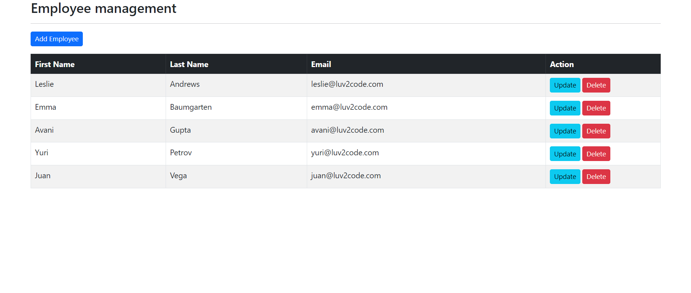
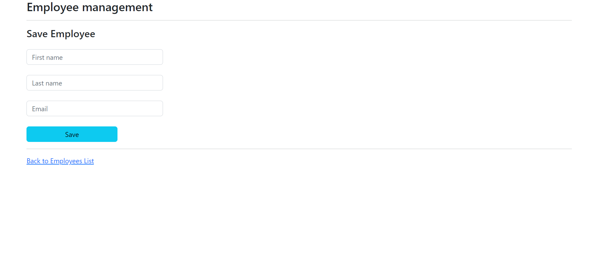
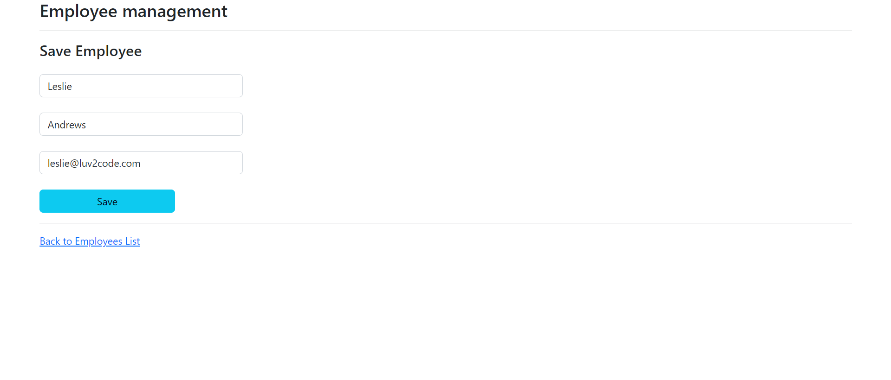
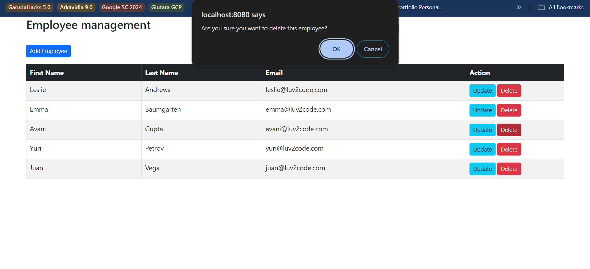

# 👨🏻‍🏫 Lecture 09 - Spring MVC
> This repository is created as a part of assignment for Lecture 09 - Spring MVC

## 🔎 Assignment 01 - Practice the Example
### 🌳 Project Structure
```bash
lecture_9
├── .mvn/wrapper/
│   └── maven-wrapper.properties
├── src/main/
│   ├── java/com/example/lecture_9/
│   │   ├── controller/
│   │   │   └── EmployeeController.java
│   │   ├── model/
│   │   │   └── Employee.java
│   │   ├── repository/
│   │   │   └── EmployeeRepository.java
│   │   ├── service/
│   │   │   ├── impl/
│   │   │   │   └─ EmployeeServiceImpl.java
│   │   │   └── EmployeeService.java
│   │   └── Lecture9Application.java
│   └── resources/
│       ├── static/
│       │   └── index.html
│       ├── templates/employees/
│       │   ├── employee-form.html
│       │   └── list-employees.html
│       └── application.properties
├── .gitignore
├── mvnw
├── mvnw.cmd
├── pom.xml
├── run.bat
└── run.sh
```

### 🧩 SQL Query Data
Here is the SQL query to create the database, table, and instantiate some data, given by the [reference repository](https://github.com/NguyenVanTrieu/spring-mvc).
```sql
-- Create the database
CREATE DATABASE week5_lecture9;

-- Use the database
USE week5_lecture9;

-- Create the employee table
CREATE TABLE `employee` (
    `id` int NOT NULL AUTO_INCREMENT,
    `first_name` varchar(45) DEFAULT NULL,
    `last_name` varchar(45) DEFAULT NULL,
    `email` varchar(45) DEFAULT NULL,
    PRIMARY KEY (`id`)
) ENGINE=InnoDB AUTO_INCREMENT=1 DEFAULT CHARSET=latin1;

-- Insert dummy data into the employee table
INSERT INTO `employee` VALUES
(1,'Leslie','Andrews','leslie@luv2code.com'),
(2,'Emma','Baumgarten','emma@luv2code.com'),
(3,'Avani','Gupta','avani@luv2code.com'),
(4,'Yuri','Petrov','yuri@luv2code.com'),
(5,'Juan','Vega','juan@luv2code.com');
```

and here is the query to drop the database
```sql
-- Drop the database
DROP DATABASE IF EXISTS week5_lecture9;
```

Also don't forget to configure [application properties](/Week%2005/Lecture%2009/Assignment%2001/lecture_9/src/main/resources/application.properties) with this format
```java
spring.datasource.driver-class-name=com.mysql.jdbc.Driver
spring.datasource.url=jdbc:mysql://localhost:3306/<your_database>
spring.datasource.username=<your_user_name>
spring.datasource.password=<your_password>
```

### ⚙️ How to run the program
1. Go to the `lecture_9` directory by using this command
    ```bash
    $ cd lecture_9
    ```
2. Make sure you have maven installed on your computer, use `mvn -v` to check the version.
3. If you are using windows, you can run the program by using this command.
    ```bash
    $ ./run.bat
    ```
    And if you are using Linux, you can run the program by using this command.
    ```bash
    $ chmod +x run.sh
    $ ./run.sh
    ```

If all the instruction is well executed, the main-view will be something like this.



### 📸 Screenshots
Here is some result of the views and APIs created based on simple MVC architecture. 
<br>
#### Initial state

1. **Get All Employees**

    
2. **Add New Employee**

    
3. **Edit Existing Employee Data**

    
4. **Delete Employee**

    