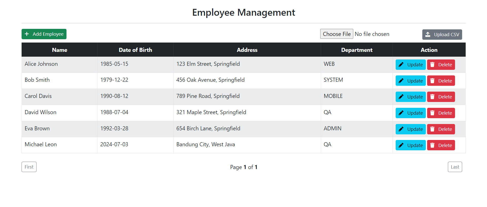

# 👨🏻‍🏫 Lecture 09 - Spring MVC
> This repository is created as a part of assignment for Lecture 09 - Spring MVC

## ✍🏼 Assignment 02 - CRUD Project for Employee Management
### 🌳 Project Structure
```bash
lecture_9_2
├── .mvn/wrapper/
│   └── maven-wrapper.properties
├── src/main/
│   ├── java/com/example/lecture_9_2/
│   │   ├── config/
│   │   │   └── DateConfig.java
│   │   ├── controller/
│   │   │   └── EmployeeController.java
│   │   ├── data/
│   │   │   └── ImportData.csv
│   │   ├── model/
│   │   │   └── Employee.java
│   │   ├── repository/
│   │   │   └── EmployeeRepository.java
│   │   ├── service/
│   │   │   ├── impl/
│   │   │   │   └─ EmployeeServiceImpl.java
│   │   │   └── EmployeeService.java
│   │   ├── utils/
│   │   │   ├── DateUtils.java
│   │   │   ├── FileUtils.java
│   │   │   └── ThymeleafUtils.java
│   │   └── Lecture92Application.java
│   └── resources/
│       ├── static/
│       │   ├── css
│       │   │   └── style.css
│       │   ├── js
│       │   │   └── script.js
│       │   └── index.html
│       ├── templates/employees/
│       │   ├── employee-form.html
│       │   └── list-employees.html
│       └── application.properties
├── .gitignore
├── mvnw
├── mvnw.cmd
├── pom.xml
├── run.bat
└── run.sh
```

### 🧩 SQL Query Data
Here is the SQL query to create the database, table, and instantiate some data.
```sql
-- Create the database
CREATE DATABASE week5_lecture9_2;

-- Use the database
USE week5_lecture9_2;

-- Create the employee table
CREATE TABLE `employee` (
    `id` VARCHAR(50) NOT NULL,
    `name` VARCHAR(100) COLLATE utf8mb4_unicode_ci NOT NULL,
    `dob` DATE NOT NULL,
    `address` VARCHAR(255) NOT NULL,
    `department` VARCHAR(100) NOT NULL,
    PRIMARY KEY (id)
);

-- Insert dummy data into the employee table
INSERT INTO Employee (id, name, dob, address, department) VALUES
('1caa1b8e-678c-41a2-9d91-234f1d75f777', 'Alice Johnson', '1985-05-15', '123 Elm Street, Springfield', 'WEB'),
('2bff2b8f-789d-41b3-9e92-345f2d86f888', 'Bob Smith', '1979-12-22', '456 Oak Avenue, Springfield', 'SYSTEM'),
('3ccd3c90-890e-41c4-9fa3-456f3d97f999', 'Carol Davis', '1990-08-12', '789 Pine Road, Springfield', 'MOBILE'),
('4dde4d91-901f-41d5-9fb4-567f4e08faaa', 'David Wilson', '1988-07-04', '321 Maple Street, Springfield', 'QA'),
('5eef5e92-0120-41e6-9fc5-678f5e19fbbb', 'Eva Brown', '1992-03-28', '654 Birch Lane, Springfield', 'ADMIN');
```

and here is the query to drop the database
```sql
-- Drop the database
DROP DATABASE IF EXISTS week5_lecture9_2;
```

Also don't forget to configure [application properties](/Week%2005/Lecture%2009/Assignment%2002/lecture_9_2/src/main/resources/application.properties) with this format
```java
spring.datasource.driver-class-name=com.mysql.jdbc.Driver
spring.datasource.url=jdbc:mysql://localhost:3306/<your_database>
spring.datasource.username=<your_user_name>
spring.datasource.password=<your_password>
```

### ⚙️ How to run the program
1. Go to the `lecture_9_2` directory by using this command
    ```bash
    $ cd lecture_9_2
    ```
2. Make sure you have maven installed on your computer, use `mvn -v` to check the version.
3. If you are using windows, you can run the program by using this command.
    ```bash
    $ ./run.bat
    ```
    And if you are using Linux, you can run the program by using this command.
    ```bash
    $ chmod +x run.sh
    $ ./run.sh
    ```

If all the instruction is well executed, the main-view will be something like this. Open [localhost:8080](http://localhost:8080) to see the view.

### 📸 Screenshots
Here is some result of the views and APIs created based on simple MVC architecture. 
<br>
#### Initial state

1. **Get All Employees**

    
2. **Add New Employee (Empty Field Exist)**

    
3. **Add New Employee (Valid)**

    
4. **Edit Existing Employee Data**

    

    
5. **Delete Employee**

    

    
6. **Empty Employees**

    
7. **Upload Employees Data via CSV (Invalid Format)**

    
8. **Upload Employees Data via CSV (Valid Format)**

    

    
9. **Pagination View**

    

    

    